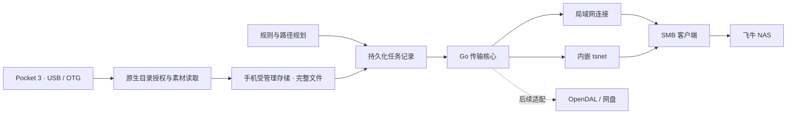

# Ferry 架构提案

本方案围绕 Pocket 3 OTG、飞牛 SMB 和内嵌 tsnet。首期先交付 Android／Pixel 6 Pro，紧随其后补全 iOS／iPhone 17 Pro／USB-C。具体依赖版本在可行性实验后固定。

## 模块边界

建议首期 Android 使用 Kotlin／Jetpack Compose，后续 iOS 使用 Swift／SwiftUI。来源授权、应用生命周期、前台服务和凭据存储由原生层负责。规则、确定性的路径规划、SMB 传输和 tsnet 放入共享 Go 核心，避免两端重复实现协议。Android 实现不能将平台 URI、Context 或服务对象泄漏进共享核心。

Go 核心首期输出 Android AAR，并尽早验证后续 iOS Framework／XCFramework 的桥接路径。先验证 gomobile 对实际依赖的构建与运行情况；必要时使用单一 Go 产物的 C ABI。上游 libtailscale 的 iOS 构建是参考，不把两个各带 Go runtime 的独立静态库同时链接进 App。[gomobile 文档](https://pkg.go.dev/golang.org/x/mobile/cmd/gomobile)、[libtailscale 构建](https://github.com/tailscale/libtailscale/blob/main/Makefile)。

桥接只传任务描述、沙盒文件路径、进度事件和取消指令。视频数据通过文件读取，不把整个视频转成桥接层字节数组。

## 来源适配

### Android

优先通过 Storage Access Framework 访问系统提供的外接存储目录。保存 provider 允许的只读持久授权，使用前确认目录可枚举、可读取。

USB 接入事件只作为重新检查来源的信号。USB 设备授权与 SAF 目录授权是两件事；收到接入事件不等于获得文件读取权限。Pocket 3 的 VID／PID、系统挂载表现和重连后的 URI 是否稳定需实测，不预填猜测值。[USB Host](https://developer.android.com/develop/connectivity/usb/host)、[SAF](https://developer.android.com/training/data-storage/shared/documents-files)。

首期不默认自己实现 USB Mass Storage／exFAT 驱动。若目标手机未通过系统 provider 暴露目录，应明确兼容性限制，再单独评估读取适配。

### iOS，紧随后续版本

通过系统文件选择器取得外接素材目录的 security-scoped URL，保存 bookmark。读取时恢复授权、使用文件协调机制，结束后释放访问。重连后 bookmark 不可用时要求重新选择目录。[Apple 目录访问文档](https://developer.apple.com/documentation/uikit/providing-access-to-directories)。

用户打开 App 后检查来源。iOS 版本不依赖外接 USB 事件在后台唤醒应用；离开前台时停止新任务，取消或收尾当前操作并保存状态。实测只考虑 iPhone 17 Pro／USB-C。

## 本地存储和任务状态

原生层使用 SQLite 持久化任务，Android 可用 Room，iOS 具体封装在实验后选择。Go 核心执行受控的单次操作，由原生任务管理器先持久化操作意图，再发起操作；完成事件持久化后才进入下一阶段。

核心记录：

| 记录 | 内容 |
| --- | --- |
| SourceBinding | 应用内来源 ID、平台授权引用、用户选择的设备配置 |
| SourceItem | 相对路径、可用的大小／时间、扫描版本、对应内容哈希 |
| Asset | 已导入副本的位置、真实字节数、SHA-256、完整性状态 |
| DestinationRevision | 主机、共享、根目录和网络方式的不可变快照；凭据只保存引用 |
| TransferJob | 内容、目标版本、冻结的路径、临时远端路径、当前阶段和错误 |
| Verification | 校验方法、时间、远端大小和内容校验结果 |

来源 ID 表示用户绑定的逻辑来源，不冒充经过认证的相机序列号。USB 地址、卷名、目录名不足以证明物理设备身份。

受管理副本位于应用私有的持久文件目录，不使用系统可随时回收的 cache／tmp 目录，并从自动云备份中排除。导入写入专用 `.partial` 文件，流式计算 SHA-256，完成后确认读取字节数和来源可用性，刷新数据并重命名为完整副本，再提交数据库记录。源信息发生变化或读取异常时不将该文件标记为完整。启动时对账孤立副本、未完成导入和执行中任务。

大小／时间用于扫描加速；它们不证明内容相同。重连后没有可靠版本信息的候选文件需重新读取计算哈希后再决定跳过。哈希说明实际读取到的字节；来源持续变化时不能把一次读取宣称为设备的原子快照。

## SMB 传输

选择能够接受既有 `net.Conn` 的 Go SMB 客户端。`go-smb2` 的 `Dialer.Dial(conn)` 是候选接口，需进一步验证 SMB 协商、签名／加密、移动端稳定性和无覆盖提交能力。[上游示例](https://github.com/hirochachacha/go-smb2)。

局域网使用系统 TCP 连接；tsnet 模式使用 `tsnet.Server.Dial(ctx, "tcp", "host:445")`，再把该连接交给同一 SMB 客户端。因此 SMB 适配不依赖系统 VPN 或本机 SMB 挂载。

上传顺序：

1. 持久化任务和应用拥有的唯一远端临时路径。
2. 在目标共享内排他创建临时文件，上传完整手机副本。
3. 关闭／刷新远端文件，读回临时文件流式计算 SHA-256，与本地完整副本比对。
4. 使用服务器支持的无覆盖重命名提交最终路径。
5. 记录已完成后按策略回收手机副本。

SMB 没有本方案可普遍依赖的远端 SHA-256 接口，因此首期采用读回校验，会增加网络流量和耗时。后续可信的 NAS 校验服务可以作为单独能力。

最终路径已存在时先校验其内容，相同则复用，不同则进入冲突状态。不能只依赖「先检查再重命名」防止并发覆盖；所选客户端与服务器必须支持提交时拒绝替换既有文件。若不能实现，暂停该实现路线并调整提交方式。

首期承诺任务恢复和文件级重试，不承诺任意字节位置续传。App 被终止后先检查本任务的临时／最终文件；无法确认的部分文件在新的本任务临时路径上重传。后续分块续传必须验证已传内容与所有权。

## tsnet 生命周期

每个安装实例维护一个持久的应用节点；任务间复用节点，离开允许运行的生命周期时释放连接与运行资源，重启后复用身份。提供登录状态、登录链接、退出与重新认证操作。

节点状态保存在受保护的应用私有存储，密钥与 SMB 凭据使用 iOS Keychain 或 Android Keystore 支撑的加密存储。示例和配置导出均不包含节点密钥或账号密码。

首期使用浏览器交互登录，不内置共享 auth key。tsnet 登录成功后仍要检查 NAS 路由、访问策略与 TCP 445 可达性；Tailscale 身份不替代 SMB 账号权限。

NAS 可以直接加入 Tailnet；通过子网路由访问时，必须另行验证实际路由和授权。tsnet 模式禁止静默回退到局域网，也不因支持 exit node 就默认改变普通网盘流量的出口。

tsnet 只承载接入它的应用连接。它不是自动提供给系统所有库的路由，也不能延长 iOS App 的后台运行时间。[tsnet 官方说明](https://tailscale.com/docs/features/tsnet)、[tsnet 源码](https://github.com/tailscale/tailscale/blob/main/tsnet/tsnet.go)。

## 运行模式与中断

iOS 和 Android 的 `on_open` 模式：应用进入前台时对账并自动恢复系统原因暂停的任务；离开前台时停止新任务、取消在途操作、保存结果，必要时重新建立 tsnet 和 SMB 会话。人工暂停保持暂停。

Android 可选 `on_attach` 模式：经实测的系统接入流程进入允许启动服务的状态，再按工作性质使用前台服务。USB 导入和网络上传分别匹配适用服务类型；网络上传不能伪装成设备连接工作来规避超时。任务持续显示通知、可停止，处理启动拒绝、超时和 OEM 终止。[Android 传输任务选择](https://developer.android.com/develop/background-work/background-tasks/data-transfer-options)。

普通 SMB 与应用内 tsnet 不适用 iOS 后台 URLSession 文件上传托管。后续 iOS 版本采用用户已经接受的前台运行范围。[Apple 后台 URLSession 限制](https://developer.apple.com/documentation/foundation/downloading-files-in-the-background)。

## OpenDAL 后续接入

先定义存储能力接口：读取、写入、查询、内容校验、提交、删除自有临时文件、取消。各目标声明可用校验、无覆盖提交和续传能力，任务管理不假设所有后端具备相同能力。

OpenDAL 作为网盘／对象存储候选；当前查阅的公开 services 列表未列出 SMB，首期不将飞牛 SMB 建立在它上面。列表中的 Aliyun OSS 是对象存储，不应当视作阿里云盘。[OpenDAL services](https://opendal.apache.org/docs/rust/opendal/services/)。

引入前验证移动端构建、绑定层、所需服务、认证刷新、包体和取消行为。若 OpenDAL 使用自己的 HTTP／socket 栈，它不会自动通过 tsnet；必须明确桥接或选择支持该流量的传输方式。通过应用内代理也不能宣称在 iOS 挂起后继续运行。
