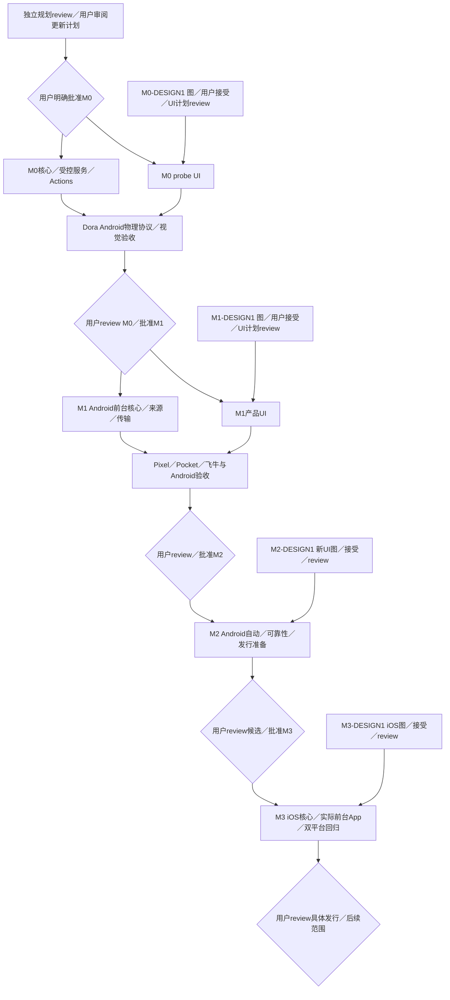

# Ferry 实施计划

状态：**Android优先修订提案，应用实现仍等待用户明确批准。** [本轮独立审查](reviews/android-first-design-revision-review.md)与用户决定分别记录。2026-10-02最新要求：iOS延迟M3，早期不追求双平台；任何UI先用 `build-web-apps:frontend-app-builder` 生成设计图。旧M1双平台提案和其审批问题已经过期，历史记录保留原SHA／范围。

本轮只做[规划修订](plans/android-first-design-revision.md)与供用户审阅的Android概念；无应用／CI实现或设备占用。M0–M2没有macOS／Xcode、iOS桥接／签名／回归gate；Go只保持正常模块边界和规则向量，不为iOS预建平台框架。

## 每阶段做什么、交付什么、怎样通过

| milestone | 明确工作／实际产物 | 环境与可重复PASS | 阻塞／用户gate |
| --- | --- | --- | --- |
| [M0](plans/m0.md) Android受控协议 | 工具链、单Go核心、受控SMB／tsnet、先设计的诊断probe、Actions真APK、Dora物理机实验 | host注入net.Conn完整读回；Dora Android physical App内tsnet传非稀疏>4GiB构造数据摘要一致、竞争无覆盖、取消／重启恢复；APK/hash/CI与视觉对照明确 | 缺服务可达／新lease／关键能力则对应项阻塞；不要求Pocket／飞牛或任何iOS条件；独立验收后用户批准M1 |
| [M1](plans/m1.md) Android前台基础版 | 规则／Room／来源／完整副本、LAN／tsnet生产传输、前台恢复、按接受图实现的App／真实APK | Pixel＋Pocket＋飞牛两路径真实大文件摘要一致，权限／拔线／空间／kill／冲突／暂停结果明确；接受图与native截图对照 | 指定USB／NAS缺失不标完整通过；APK／设备／摘要／错误与视觉报告；用户review后批准M2，无iOS前提 |
| [M2](plans/m2.md) Android自动模式与发行准备 | 可选接入／合法FGS／停止通知／故障恢复；Android双语文档、许可通知、干净构建及实际发行候选 | 真机默认关闭、合法入口启动、停止即停、拒绝／超时／终止恢复不误完成；Linux按文档构建安装，包／SHA／许可／秘密核查通过 | 适用场景未测或Android正式签名／渠道未定则相关项阻塞；用户review候选、具体Android发布动作和M3计划 |
| [M3](plans/m3.md) iOS可用版与双平台交付 | 此时才做iOS单Go桥接／工程／SwiftUI／来源／spool／SQLite／Keychain／前台网络；实际iOS包和双平台说明 | macOS签名安装；Dora iOS普通流程；Pocket→iPhone17 Pro USB-C→飞牛LAN／tsnet真实摘要一致，挂起／恢复／冲突通过；Android回归、规则一致、接受iOS图对照 | 缺macOS／签名／lease／指定USB则对应M3项阻塞；双平台包/hash/矩阵及独立review后用户决定具体发布和后续范围 |

M2吸收Android发行准备是本次执行方案，随计划供用户review。正式签名／渠道尚未决定时保留相应发行阻塞，不把验证APK当正式发布。每份阶段文件有具体任务范围和逐项动作／预期／证据；不能仅以“支持／完善／稳定”判定通过。

## UI设计关口

专门design agent使用指定skill／Image Gen，先生成完整surface与必要状态，再供用户接受。只有接受之后才提取tokens、组件、可见文案和详细UI实施清单，独立review后在已批准阶段中实施。设计接受与milestone批准是两个记录，互不代替。

本轮概念brief覆盖M0诊断主屏与M1任务／来源／目标／规则及关键暂停／完成／权限／空间／中断状态，约6–7张可读手机图是估算而非上限。概念中的fixture数字不代表设备连接或真实上传。M2新增设置／通知、M3 iOS必须各自先图与接受，不能因复用Android语言而自动通过。

本计划只规定功能／文件owner／数据与验收，不提前指定视觉布局或tokens。原生技术栈仍为Android Compose和M3 SwiftUI；最终用view_image对照接受图与native截图，至少检查文案、层级、字体、颜色、间距／容器五项，记录copy diff与fidelity ledger。浏览器稿仅补充视觉，不代native功能／USB／生命周期；没有web实现不声称Browser QA通过。

每阶段DESIGN1仅阻塞其UI计划／实现节点；非UI核心可在用户批准阶段后按DAG推进。

图中M2／M3聚合节点的设计依赖仅适用于可见UI子任务，详细计划展开非UI可并行包；不能把聚合图误读为全部核心必须先等出图。

## 任务执行、文件owner与review

agents承担规划、实现、验证和交付；用户负责阶段决定、设计接受与必要物理操作。每复杂任务按“落文件plan→独立review plan→impl→独立review实现／验收”。作者不能审自己的变更，旧PASS不覆盖新范围／SHA。

每包登记稳定issue ID、直接依赖／blocks、branch／base／worktree、文件owner、产物和可判验收。接口冻结且前置满足后并行；同文件单owner，构建配置显式移交，Dora租约单会话owner。PR基线更新后重跑受影响检查。

原子提交使用小写type与具体描述，沿用用户Git身份；review记录完整SHA／文件hash、作者／reviewer、发现／修订和证据。设备／传输／视觉结果区分PASS、FAIL、BLOCKED、NOT_RUN，CI或PR合并不代用户gate。

## 历史33个issue与新增任务迁移

| 原ID／issue | 当前归属与处理 |
| --- | --- |
| M0-A1–A6 #3–8、C1／C2、R0 #13 | 留M0；A5 UI额外依赖M0-DESIGN1，Android核心不预制iOS接口 |
| M0-B1 #9／B2 #10 | 留M1真实Pocket／Pixel／飞牛，无iOS前置 |
| M0-B3 #11 | 保留非实施拆分记录；前台→M1-V1，自动→M2-AUTO1／REC1，不能标作功能已完成 |
| M0-X1 #12、M1-BUILD0 #24、M1-I1 #26 | 保留ID／历史issue，迁M3；X1→BUILD0→I1，Android不依赖它们 |
| M1-P1–P7 #14–20 | 当前职责限定Android；P6 #19移除BUILD0/I1前置，P7 #20只验Android；P5依赖M1-DESIGN1接受和UI计划review |
| M1-D1／T1、V1 #28 | D1/T1继续Android实际来源／生产传输；V1仅Android，原iOS验收迁新M3-IOSV1 |
| M2-AUTO1 #29／REC1／V1 #31 | 留M2，去iOS回归；AUTO1新增UI依赖M2-DESIGN1 |
| M3-DOC1／BUILD1／V1 #32–34 | 留M3负责iOS加入后的文档／真实产物／最终双平台验收；Android首发职责显式移新M2-DOC1／BUILD1 |
| 新M0／M1／M2／M3-DESIGN1 | 各阶段完整图／接受／后续视觉spec与计划；本轮只当前Android概念，后续新surface到阶段再做 |
| 新M3-IOSV1 | Dora iOS物理与Pocket／iPhone17 Pro USB-C／飞牛及视觉／恢复，前置真实签名iOS包 |

新增7个任务：四个DESIGN1、M2-DOC1／BUILD1、M3-IOSV1。原33issue逐项保留当前映射和历史，迁移不等于完成。M3最终BUILD1不是I1前置；先行BUILD0独立完成后移交入口／构建owner，避免循环。

## 共同验收底线与停止条件

| 类别 | 判定要求 |
| --- | --- |
| 来源 | 授权树内只读，不修改相机；普通provider／Dora不代Pocket USB |
| 副本与容量 | partial不能上传，预算含保留／并发，未知大小受上限控制，不清未完成副本 |
| 内容与提交 | 完整读回SHA-256一致，服务端no-replace；只比大小或exists＋rename均不通过 |
| 状态与恢复 | 外部操作前落意图，提交后记录前kill可对账；无证据不完成，仅清自有临时对象 |
| 生命周期 | M1仅Android前台，人工暂停不解除；M2可选模式合法且可停止；M3 iOS仍仅前台 |
| 设计 | 接受图之后才有视觉spec与详细UI清单；native截图对照与交互分别验收，无假运行截图 |
| 身份与秘密 | StateStore真实受保护；不泄露凭据／节点状态；Dora新lease、每次操作核session、finally清理 |
| 产物与证据 | 真实APK，M3真实可安装iOS包；SHA／hash／环境／路径明确，host／Dora／用户USB、LAN／tsnet分别报告 |

关键能力不成立、无合法网络／设备授权、用户尚未批准阶段、设计未接受却要做视觉细节时停止依赖步骤。独立节点只在已批准范围内继续。用户每次收到计划／PR／SHA、实际产物、独立review、逐项证据／未测、下一范围；明确批准后再进入下一milestone。

## 未排期backlog

OpenDAL／网盘、多目标、分块续传、元数据和其他相机未排期，不是可执行milestone。选定具体服务后另写功能／产物／环境／可判定验收／设计范围并review，再经用户批准加入DAG，不自动开始。
