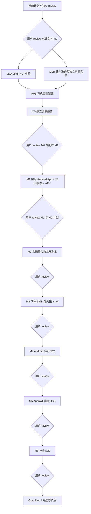

# Ferry 实施计划

状态：**等待用户 review；当前只准备和提交计划，尚未授权应用实现。** 全部能力仍需验证。Android／Pixel 6 Pro 先交付，紧随其后补全 iOS／iPhone 17 Pro／USB-C，再评估 OpenDAL／网盘。

## 执行与审查约定

设计、实现、测试、CI、文档和交付由 agents 推进。用户负责 milestone review、产品决策及必须由设备持有人完成的物理接线／系统授权。

每个复杂工作包严格遵循：**书面 plan → 独立 agent review plan → impl → 独立 agent review 实现与验收**。阻断发现修复后再次 review；实现者不得签署自己的独立通过结论。当前总计划和 M0 计划需先经用户 review。每个 milestone 的结果和下一阶段计划也需用户 review，不能自行跨越阶段。本轮 M1 仅为提前审查的候选计划，M0 后仍须用户明确批准。

| agent 角色 | 责任 |
| --- | --- |
| 协调 | issue、依赖 DAG、接口冻结、集成和用户 review 包 |
| Android | 原生界面、授权、Room、生命周期、设备实验 |
| Core | Go 规则、模型、桥接、SMB／tsnet |
| Delivery | 工具链、Actions、真实 APK 产物和安装检查 |
| Review | 独立检查计划、实现、错误路径和验收证据 |

每个工作包对应 issue，包含依赖、文件范围、验收和产物；PR 链接 issue 与计划。依赖及接口明确后可分支／worktree 并行；同一时段每个文件只有一个写入者，共享构建配置由 Delivery owner 管理。agents 不共享可变设备租约或凭据目录。

原子提交采用 `<type>: <具体变更>`，type 全小写，如 `docs: define M0 hardware acceptance gates`、`feat: persist destination revisions`、`fix: retain manual pause after restart`；使用用户已有 Git 身份。计划、实现和构建变更分别可审查。

review 记录包含对象 SHA、reviewer、检查范围、发现／修订、证据和结论。验收逐项区分通过、失败、未运行；PR／CI 成功不能代替真机结果。公开证据须脱敏，不提交凭据、Tailnet 状态或私人素材。

## 里程碑 DAG

M0A／M0B 是一个 milestone 的证据分区。缺少硬件时继续所有独立的 M0A 节点，只暂停依赖硬件的节点；**M0B 未完成不能宣称 M0 通过，不能自动开始 M1 实现。** 硬件等待期间若要调整阶段范围，须先提交变更计划供用户 review。

## M0：来源、移动桥接与协议可行性

详细范围见 [M0 计划](plans/m0.md)。本轮请求用户批准的下一执行范围为 M0；实现前仍要完成独立 plan review 和阻断项修订。

M0A 包括工具链引导、单一 Go AAR、真实来源／协议诊断 App、GitHub Actions 可安装 debug APK、SMB `net.Conn` 注入与并发无覆盖提交，以及授权环境允许的 tsnet 实验。M0B 在真实 Pocket 3／Pixel 6 Pro／飞牛上验证两条网络路径、大于 4 GiB 的真实素材、授权／拔线／重连／重启和运行模式限制。

尽早进行 iOS 桥接构建实验；缺少 macOS／Xcode 时报告未运行及风险，不能用 Linux 证明 iOS 通过。M0 产物是探针和证据，不是完整 Ferry。

## M1：可运行 App、配置、规则和任务模型

详见 [M1 候选计划](plans/m1.md)。交付实际 Kotlin／Compose App、Go 规则桥接、版本化配置、确定性预览、Room 持久状态和不可变目标快照。Actions 从源码构建真实可下载 APK，附哈希／版本／测试报告和安装证据；不是占位产物或纯文档 CI。

来源／目标／规则／任务页可交互，配置和用户暂停跨进程保存。真实导入／生产 SMB 与 tsnet／自动服务分别在 M2／M3／M4 实现；M1 明确显示未实现能力，不把 fixture 当作真实成功任务。

## M2：来源导入与本地完整副本

用户 review 后细化 `android/app/src/main/.../source/`、`spool/` 与持久化适配计划。实现 SAF 读取、流式 SHA-256、完整副本、空间预留、临时提交和启动对账。

验收大文件、拔线、进程终止、权限失效、未知大小与空间不足；不完整副本不可上传，未完成副本不因容量压力删除。空间核算同时包含 partial、完整副本、保留副本和并发预留；未知大小受运行时上限控制，单文件超配置上限进入等待空间。内存不随文件大小线性增长。

## M3：飞牛 SMB 与内嵌 tsnet

预期范围 `core/storage/`、`core/storage/smb/`、`core/network/`、Android 凭据／登录／传输适配。实现明确的局域网／tsnet 路径、交互登录、底层网络约束、自有临时文件、读回校验、提交时无覆盖与恢复。

验收重复连接、冲突、断网、权限／配额／校验错误，特别覆盖提交成功但数据库落盘前进程终止的对账。校验失败保留本地副本；只清理可证明归属本任务的临时对象。重启复用安装身份，导出不带凭据。读回至少增加一份完整 SMB 读取流量；完成证据限于已校验时刻，不承诺其他 NAS 写者随后修改或掉电后的持久性。

## M4：Android 运行模式与体验

预期范围任务页、生命周期、`service/`、接入和通知。默认打开 App 执行、离开暂停、返回恢复系统暂停，人工暂停保持。可选接入模式采用经过 M0 验证的合法启动路径及适用服务类型；USB attach 和声明 `connectedDevice` 本身不赋予后台启动豁免。

验收关闭自动模式、用户停止、启动拒绝、超时、系统终止、锁屏／返回／重启。暂停原因和恢复方式可见，任务与远端内容一致。

## M5：Android 首版 OSS 交付

许可证已由用户确认为 Apache-2.0。M5 补齐适用的依赖通知、双语说明、可复现构建、发行流程和真实兼容性矩阵。CI 从 M0／M1 起提供探针／App APK，M5 强化发行，不推迟首次可下载产物。

验收新环境构建、首期真机矩阵、源码与 APK 对应。debug APK 用于验证；正式签名身份与分发渠道另经用户确认。

## M6：紧随首版补全 iOS

新增 `ios/` 原生壳、来源／副本、SQLite／Keychain／生命周期及构建；复用 Go 规则、SMB、tsnet 和测试向量。范围仅 iPhone 17 Pro／USB-C，打开 App 后运行。

真实 Pocket 3 → iPhone → 飞牛的局域网／tsnet 均通过内容校验，覆盖大于 4 GiB、重复连接、权限失效、拔线、锁屏／挂起／返回和跨平台规则一致性。缺少硬件或构建环境如实记录未运行。优先级高于网盘、多目标、转码和其他相机。

## 共同验收底线

| 场景 | 要求 |
| --- | --- |
| 来源与身份 | 不越过授权树，不修改相机，不把目录或 USB 地址冒充认证身份 |
| 中断／空间不足 | 不误标完整或完成，不清理未完成副本，保存可恢复原因 |
| 冲突 | 已有内容不被覆盖；同名不同内容均可保留；不能 exists + rename |
| 完成 | 远端读回 SHA-256 一致且最终提交已确认 |
| 生命周期 | 默认仅前台；人工暂停不自动解除；自动模式显式开启且可停止 |
| 证据 | commit／设备／网络路径明确；合成、模拟器和测试 SMB 不替代真实 OTG／飞牛 |
| 产物 | APK 可下载、校验、安装；编译成功和真机运行通过分开记录 |
