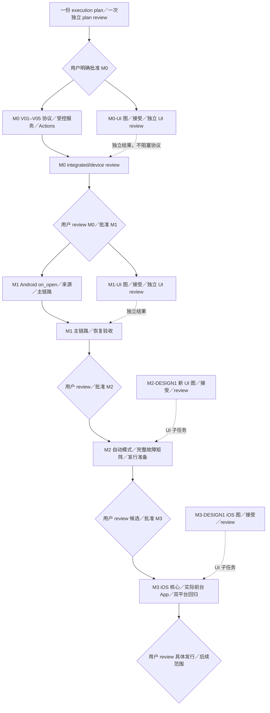

# Ferry 实施计划

状态：**Android优先范围收缩提案，应用实现仍等待用户明确批准。** [scope-trim 独立审查](reviews/scope-trim-review.md) 与 [Android 工具链独立审查](reviews/android-toolchain-review.md) 已在各自目标提交上给出 PASS；这些 PASS 只表示文档和工具链约束通过独立复核，不是用户批准 M0。当前执行依据为 [scope-trim 执行计划](plans/scope-trim.md) 与 [scope-trim review 准备记录](reviews/scope-trim-review-prep.md)。iOS 延迟 M3，早期不追求双平台；任何 UI 先用 `build-web-apps:frontend-app-builder` 生成完整设计图。旧 M1 双平台提案和其审批问题已经过期，历史记录保留原 SHA／范围。

本轮只做规划修订与供用户审阅的 Android 概念；无应用／CI 实现或设备占用。M0–M2 没有 macOS／Xcode、iOS 桥接／签名／回归 gate；Go 只保持正常模块边界和规则向量，不为 iOS 预建平台框架。

## Android 工具链与容器边界

Android 默认 `minSdk 29`（Android 10）；不处理 Android 9 及更低版本的兼容问题。
允许使用较新的 `compileSdk`／`targetSdk`，但不在规划阶段锁定随日期变化的 API
号；实现开始前由 devcontainer 内锁定稳定 SDK 工具链并记录实际版本。所有构建、
单测、静态检查、APK、Go 和 Android bridge 构建都在该 devcontainer 内进行。固定
使用 Dockerfile 并 pin `FROM` 的 base image digest 以及 SDK／JDK／NDK／Go／Gradle／
依赖版本，或使用等价的可审计 manifest；仅提供未 pin 的 Dockerfile 不满足锁定要求。
依赖缓存使用可重建卷；toolchain manifest／产物清单逐项记录 `minSdk`、`compileSdk`、
`targetSdk`、JDK、SDK（含平台／build-tools 等实际版本）、Gradle、NDK、Go、依赖（含
锁文件／依赖版本）、ABI、完整源码 SHA、工具链版本和产物 SHA-256。

宿主机只负责启动容器、做显式设备连接／转发、取回脱敏产物；Dora 只使用容器内
构建出的 APK，安装命令由 devcontainer 内通过该显式连接／转发执行。宿主不执行
安装、构建、单测或静态检查；连接／转发不单独构成构建或应用验收证据。缺少容器
运行时时，对应构建与测试为 `BLOCKED`，不得回退到当前环境。M0–M2 的容器内动作
与服务／设备外部动作分别按各阶段文件记录；该边界不增加低概率兼容矩阵或额外发布
门槛。

## 每阶段做什么、交付什么、怎样通过

| milestone | 明确工作／实际产物 | 环境与可重复PASS | 阻塞／用户gate |
| --- | --- | --- | --- |
| [M0](plans/m0.md) Android受控协议 | 工具链、单 Go 核心、受控 SMB／tsnet、诊断 probe、devcontainer 内 Actions 真 APK、Dora physical 实验 | **硬 gate V01–V05**：容器内真实 APK/AAR；Dora 安装／bridge；host `net.Conn` SMB no-replace 与读回；Dora App 内 tsnet 一次完整 SHA-256 读回；取消／终止不误完成且本地副本保留 | 连接与内容分开判定；V06–V08 为附加／条件性结果，V09 是强制安全收尾但不是协议 gate，M0-UI 独立；缺容器运行时为 `BLOCKED`，不因 >4 GiB、竞争、扩展身份或未接受视觉阻塞；用户批准 M1 |
| [M1](plans/m1.md) Android前台基础版 | 规则／Room／源只读／完整副本、`on_open` 恢复、Pocket→Pixel→fnOS 主链路、第一网络路径、devcontainer 内真实 APK | 核心 AV01–AV04、AV06、AV09：远端完整 SHA-256、no-replace、人工暂停和系统等待；第二网络补充，完整故障矩阵移 M2，M1-UI 独立 | 指定 USB／fnOS／第一路径缺失只阻塞对应主链路；AV05／AV07／AV08／AV11 如实 `OPTIONAL`／`CONDITIONAL`／`DEFERRED`／`NOT_RUN`；缺容器运行时为 `BLOCKED`；用户批准 M2 |
| [M2](plans/m2.md) Android自动模式与发行准备 | 合法接入／FGS／停止通知、**M1 延后的完整故障矩阵**、Android 双语文档、devcontainer 内干净构建与发行候选 | 默认关闭、合法入口、停止即停、拒绝／超时／终止不误完成；完整矩阵和交付报告逐项 `PASS`／`FAIL`／`BLOCKED`／`NOT_RUN` | 适用场景未测或正式签名／渠道未定只阻塞对应项；缺容器运行时只阻塞构建节点；用户 review 候选、发布动作和 M3 计划 |
| [M3](plans/m3.md) iOS可用版与双平台交付 | 此时才做iOS单Go桥接／工程／SwiftUI／来源／spool／SQLite／Keychain／前台网络；实际iOS包和双平台说明 | macOS签名安装；Dora iOS普通流程；Pocket→iPhone17 Pro USB-C→飞牛LAN／tsnet真实摘要一致，挂起／恢复／冲突通过；Android回归、规则一致、接受iOS图对照 | 缺macOS／签名／lease／指定USB则对应M3项阻塞；双平台包/hash/矩阵及独立review后用户决定具体发布和后续范围 |

M2吸收Android发行准备是本次执行方案，随计划供用户review。正式签名／渠道尚未决定时保留相应发行阻塞，不把验证APK当正式发布。每份阶段文件有具体任务范围和逐项动作／预期／证据；不能仅以“支持／完善／稳定”判定通过。

## UI设计关口

专门design agent使用指定skill／Image Gen，先生成完整surface与必要状态，再供用户接受。只有接受之后才提取tokens、组件、可见文案和详细UI实施清单，独立review后在已批准阶段中实施。设计接受与milestone批准是两个记录，互不代替。

本轮概念 brief 覆盖 M0 诊断主屏与 M1 任务／来源／目标／规则及关键暂停／完成／权限／空间／中断状态，图数按覆盖和可读性决定。概念中的 fixture 数字不代表设备连接或真实上传。M2 新增设置／通知、M3 iOS 必须各自先图与接受，不能因复用 Android 语言而自动通过。当前图集未覆盖或未被接受的状态只阻塞对应 UI 子任务；M0-UI 与 M1-UI 是独立结果，不能阻塞各自协议／主链路 gate。UI 实施仍必须先完整图、用户接受、详细 UI 计划和独立 UI review。

本计划只规定功能／文件owner／数据与验收，不提前指定视觉布局或tokens。原生技术栈仍为Android Compose和M3 SwiftUI；最终用view_image对照接受图与native截图，至少检查文案、层级、字体、颜色、间距／容器五项，记录copy diff与fidelity ledger。浏览器稿仅补充视觉，不代native功能／USB／生命周期；没有web实现不声称Browser QA通过。

每阶段DESIGN1仅阻塞其UI计划／实现节点；非UI核心可在用户批准阶段后按DAG推进。

图中M2／M3聚合节点的设计依赖仅适用于可见UI子任务，详细计划展开非UI可并行包；不能把聚合图误读为全部核心必须先等出图。

## 任务执行、文件owner与review

agents承担规划、实现、验证和交付；用户负责阶段决定、设计接受与必要物理操作。每阶段先落一份 execution plan 并做一次独立 plan review，再实现；实现完成后做最终 integrated/device/release review。作者不能审自己的变更，旧 PASS 不覆盖新范围／SHA。UI 计划仍由对应 UI reviewer 独立审查，但不把未接受图变成协议或主链路 gate。

每包登记稳定issue ID、直接依赖／blocks、branch／base／worktree、文件owner、产物和可判验收。接口冻结且前置满足后并行；同文件单owner，构建配置显式移交，Dora租约单会话owner。PR基线更新后重跑受影响检查。

原子提交使用小写type与具体描述，沿用用户Git身份；review记录完整SHA／文件hash、作者／reviewer、发现／修订和证据。设备／传输／视觉结果区分PASS、FAIL、BLOCKED、NOT_RUN，CI或PR合并不代用户gate。

## 历史33个issue与新增任务迁移

| 原ID／issue | 当前归属与处理 |
| --- | --- |
| M0-A1–A6 #3–8、C1／C2、R0 #13 | 留M0；A5 UI额外依赖M0-DESIGN1，Android核心不预制iOS接口 |
| M0-B1 #9／B2 #10 | 留M1真实Pocket／Pixel／飞牛，无iOS前置 |
| M0-B3 #11 | 保留非实施拆分记录；前台→M1-V1，自动→M2-AUTO1／REC1，不能标作功能已完成 |
| M0-X1 #12、M1-BUILD0 #24、M1-I1 #26 | 保留ID／历史issue，迁M3；X1→BUILD0→I1，Android不依赖它们 |
| M1-P1–P7 #14–20 | 当前职责限定Android；P6 #19移除BUILD0/I1前置，P7 #20只验Android；P5依赖M1-DESIGN1接受和UI计划review |
| M1-D1／T1、V1 #28 | D1/T1继续Android实际来源／生产传输；V1仅Android，原iOS验收迁新M3-IOSV1 |
| M2-AUTO1 #29／REC1／V1 #31 | 留M2，去iOS回归；AUTO1新增UI依赖M2-DESIGN1 |
| M3-DOC1／BUILD1／V1 #32–34 | 留M3负责iOS加入后的文档／真实产物／最终双平台验收；Android首发职责显式移新M2-DOC1／BUILD1 |
| 新M0／M1／M2／M3-DESIGN1 | 各阶段完整图／接受／后续视觉spec与计划；本轮只当前Android概念，后续新surface到阶段再做 |
| 新M3-IOSV1 | Dora iOS物理与Pocket／iPhone17 Pro USB-C／飞牛及视觉／恢复，前置真实签名iOS包 |

新增7个任务：四个DESIGN1、M2-DOC1／BUILD1、M3-IOSV1。原33issue逐项保留当前映射和历史，迁移不等于完成。M3最终BUILD1不是I1前置；先行BUILD0独立完成后移交入口／构建owner，避免循环。

## 共同验收底线与停止条件

| 类别 | 判定要求 |
| --- | --- |
| 来源 | 授权树内只读，不修改相机；普通provider／Dora不代Pocket USB |
| 副本与容量 | partial不能上传，预算含保留／并发，未知大小受上限控制，不清未完成副本 |
| 内容与提交 | 完整读回SHA-256一致，服务端no-replace；只比大小或exists＋rename均不通过 |
| 状态与恢复 | 外部操作前落意图，提交后记录前kill可对账；无证据不完成，仅清自有临时对象 |
| 生命周期 | M1 仅 Android `on_open`，人工暂停不解除；完整故障矩阵移 M2；M2 可选模式合法且可停止；M3 iOS 仍仅前台 |
| 设计 | 接受图之后才有视觉 spec 与详细 UI 清单；M0-UI／M1-UI 独立于协议／主链路 gate；native 截图对照与交互分别验收，无假运行截图 |
| 身份与秘密 | 不泄露凭据／节点状态；Dora 新 lease、每次操作核 session、finally 清理；扩展身份／生命周期低概率证据按 `OPTIONAL`／`CONDITIONAL`／`NOT_RUN` 记录 |
| 产物与证据 | 真实 APK，M3 真实可安装 iOS 包；完整源码 SHA／devcontainer 工具链／ABI／产物 SHA-256、环境／路径明确，host／Dora／用户 USB、第一路径／补充路径分别报告 |

关键能力不成立、无合法网络／设备授权、缺少 devcontainer 运行时、用户尚未批准阶段、设计未接受却要做视觉细节时停止依赖步骤。独立节点只在已批准范围内继续。用户每次收到计划／PR／SHA、实际产物、独立review、逐项证据／未测、下一范围；明确批准后再进入下一milestone。

## 未排期backlog

OpenDAL／网盘、多目标、分块续传、元数据和其他相机未排期，不是可执行milestone。选定具体服务后另写功能／产物／环境／可判定验收／设计范围并review，再经用户批准加入DAG，不自动开始。
