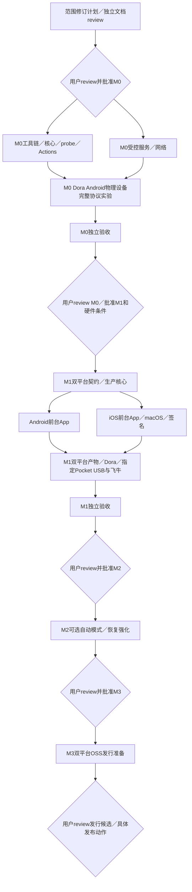

# Ferry 实施计划

状态：**范围修订提案，应用实现等待用户明确批准。** 独立 review 状态见[本轮审查记录](reviews/milestone-scope-revision-review.md)。 尚无可运行 App或协议／相机实测。2026-10-02 用户决定：iOS 移入 M1；SMB 可先用 Dora 云端物理设备验证；M0 结束后再考虑用户设备完整链路。[修订计划与历史迁移](plans/milestone-scope-revision.md)保留原阶段／issue关系。

## 当前阶段与用户关口

| milestone／详细计划 | 明确要做的事情 | 交付产物 | 测试环境及可判定PASS | 阻塞／用户gate |
| --- | --- | --- | --- | --- |
| [M0](plans/m0.md) 受控协议实验 | 工具链、单Go核心、Android probe、SMB读回／无覆盖、内嵌tsnet、Actions与Dora物理机实验 | 真debug APK／哈希／CI／版本、受控服务与协议报告、lease cleanup证据 | host net.Conn＋受控SMB；Dora Android physical安装、tsnet传>4GiB非稀疏构造文件并读回一致，竞争／中断通过 | 无服务可达路径／lease／关键能力则相关项阻塞；不要求Pocket／Pixel／真实飞牛；结果独立review后用户批准M1 |
| [M1](plans/m1.md) 双平台前台基础版 | Android＋iOS真实规则／状态／只读导入完整副本、LAN／tsnet SMB、恢复和暂停；M0后开展Pocket完整链路 | Android APK、可安装签名iOS产物／路径、配置／规则向量、双平台操作／恢复／兼容报告 | 干净Linux／macOS构建；Dora普通网络／生命周期；Pocket→Pixel和Pocket→iPhone17 Pro USB-C→飞牛两路径真实大文件摘要一致、故障对账通过 | macOS／签名／指定USB／NAS缺失不标整阶段通过；M0后用户确认条件并批准M1，结束review再批准M2 |
| [M2](plans/m2.md) Android自动模式与恢复强化 | 显式可选接入、合法FGS入口、停止通知、超时／拒绝／系统终止处理 | 实际APK／版本、系统／入口矩阵、故障与iOS前台回归报告 | Pixel＋Pocket接入；默认关闭、开启按合法入口运行、停止即停；kill／超时恢复无误完成／覆盖，人工暂停不解除 | 合法入口不成立／关键系统场景未测则阻塞或重新review范围；用户review后批准M3 |
| [M3](plans/m3.md) 双平台OSS发行准备 | 双语说明、Apache-2.0及依赖通知、干净构建／签名／分发清单、真实兼容矩阵 | 源码SHA／版本／真实安装产物与哈希、复现记录、发行候选和审查包 | 独立agent按文档在Linux／macOS构建并安装，双平台核心流程回归，产物来源／许可／秘密核查通过 | 签名／渠道缺失则发行项阻塞；用户review具体发行候选和发布动作后发布，之后backlog另立计划 |

M1 双平台可用前台版是落实用户新排期的具体方案，仍待本轮用户review，不宣称已获实现批准。所有阶段逐项区分 PASS／FAIL／BLOCKED／NOT_RUN；缺必要硬件不等于允许用Dora替代USB。用户可明确修改范围，但当前没有硬件豁免。

## 任务执行与独立审查

工作由 agents 推进；用户负责milestone决定及必须本人操作的物理接线／系统授权。协调agent管理DAG、文件owner和证据；Android、iOS、Core、Delivery分别实现；review agent独立审查，作者不能审自己的变更。

每复杂包遵循**落文件plan → 独立review plan → impl → 独立review实现和验收**。本轮先修订文档，再独立review与用户关口；没有应用／CI实现或设备占用授权。只读环境调查不等于测试通过。阶段内无依赖包可并行，依赖满足／接口冻结后才开始使用者，跨阶段必须用户批准。

每包有稳定issue ID、依赖、分支／base／worktree、文件owner、产物和验收。共享构建配置单owner；设备租约归单会话操作owner，其他agents不共用。PR关联计划／issue和完整SHA；依赖合并后更新base并重跑受影响验证。

原子提交用小写type和具体描述，如 `feat: retain imported files until readback succeeds`；使用用户Git身份。review记录对象SHA／文件hash、reviewer、发现／修订和证据。旧PASS只适用于旧范围与SHA，不能覆盖本次阶段迁移。

## 历史任务迁移与当前依赖

| 旧任务／issue | 当前归属与依赖变化 |
| --- | --- |
| M0 A1–A6 | 保留M0；新增M0-C1受控服务／C2 Dora physical；R0依赖云端协议验收，不依赖Pocket |
| M0-B1 #9／B2 #10 | 迁M1保留历史ID；B1等Android来源／App，B2等B1／生产传输／真实飞牛 |
| M0-B3 #11 | 历史拆分入口：前台范围→M1-V1；自动模式→M2-AUTO1／REC1，不作为已完成任务关闭 |
| M0-X1 #12 | 迁M1必需iOS桥接／构建／运行前置，不再作为可忽略早期风险项 |
| M0-R0 #13 | 保留M0，改审M0新V01–V09矩阵并说明未测USB／飞牛 |
| M1-P1–P7 #14–#20 | 保留ID；P1双平台契约，P4／P5保持Android owner，P6双平台构建，P7完整双平台验收 |
| 新M1-BUILD0／D1／I1／T1／V1 | 先行iOS工程配置／Android来源副本／iOS原生App／共享生产传输／双平台与USB验收；按详细DAG集成 |
| 旧M2来源、旧M3网络、旧M6 iOS | 核心功能吸收进M1；旧阶段标迁移／替代，不标完成 |
| 旧M4／M5 | 前台能力进M1，自动模式留修订后M2；发行变为修订后M3 |

不复用旧验收编号当新通过结论：M0／M1新矩阵为 `M0-Vxx`／`M1-Vxx`，旧矩阵保留在历史提交中。GitHub迁移记录旧milestone、ID／issue、新归属和替代节点；拆分任务等后继证据齐备才能按真实结果结案。

## 共同验收底线

| 场景 | 可判定要求 |
| --- | --- |
| 来源 | 不越过授权树，不写／改名／删除相机素材；云普通provider不代替USB |
| 完整副本与空间 | partial不准上传；预算包含保留和并发；未知大小到上限停止，不清未完成副本 |
| 内容与冲突 | 完整读回SHA-256一致，服务端提交时拒绝覆盖；不能只比大小或exists＋rename |
| 完成与恢复 | 外部操作前落意图；提交后记录前kill可对账；无证据不完成，仅清本任务临时对象 |
| 生命周期 | M1仅前台；人工暂停不解除；M2自动模式显式开且可停止，不能滥用FGS类型 |
| 平台与产物 | 真APK／实际iOS签名安装、源码SHA／哈希对应；host、Dora、用户USB、LAN／tsnet逐路径记录 |
| 凭据与租约 | 无秘密入git／产物／日志；Dora每会话新lease、每次操作核ID、finally清理释放 |

每阶段向用户交付详细计划、PR／SHA、独立review、实际产物、逐项证据、未决／未测和下一阶段范围。内部PASS、CI成功、PR合并或用户未回复不能代替用户批准。

## 未排期 backlog

OpenDAL／网盘、多目标、分块续传、拍摄元数据、其他相机仍未排期；它们不是可直接执行的milestone。选择具体目标后先写文件范围、认证／网络／完整性能力、实际产物、测试环境与可判定验收，独立review并经用户批准后才纳入DAG。不会以该backlog绕过M1 iOS或数据完整性要求。
