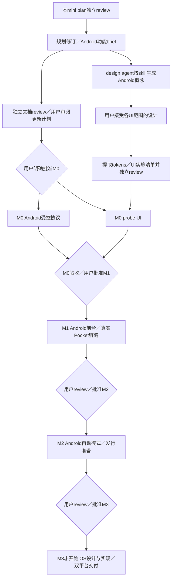

# Android 优先与先生成 UI 设计图：范围修订计划

> **历史／superseded：本文件不再是当前执行依据。** 当前范围以 [scope-trim 执行计划](scope-trim.md) 和 [scope-trim review 准备记录](../reviews/scope-trim-review-prep.md) 为准；本文件保留原提案、原 gate 和原 SHA 供历史追溯。旧 M0 大文件／竞争／完整中断、M1 双路径／空间边界不得从本文件重新执行。

状态：历史范围修订执行计划；独立 plan 与最终变更 review 只适用于本文件当时的快照，不覆盖 scope-trim。2026-10-02 的 Android 优先决定仍保留为历史背景，当前用户 gate 与实现范围见 scope-trim。

## Current scope-trim mapping

- M0 协议硬 gate 仅为 V01–V05：真实 APK/AAR、Dora bridge、host `net.Conn` SMB no-replace／读回、Dora App 内 tsnet 至少一次完整 SHA-256 读回、取消／终止不误完成且本地副本保留。
- >4 GiB、竞争、完整身份／持久安全、provider 生命周期和视觉结果是附加／条件性／`NOT_RUN`，M0-UI 独立且不阻塞协议 gate。
- M1 只把 Android `on_open`、源只读／完整副本／远端读回／规则／人工暂停、Pocket→Pixel→fnOS 主链路和一条网络路径作为核心；第二路径补充，完整故障矩阵移 M2。
- 用户仍须分别接受设计范围并批准 milestone；scope-trim 未获用户批准前不开始应用、Dora 或 SMB 实验。

## 用户决定与落实方案

用户明确要求：“iOS 延迟到 m3，我们早期不纠结双平台支持；任何 UI 方案都使用 build-web-apps:frontend-app-builder 先生成设计图”。因此 M0–M2 不含 macOS／Xcode、iOS bridge、签名、安装或 iOS 回归 gate，也不为未来 iOS 预先实现平台抽象／生产代码。Go 保留正常模块边界、确定性规则向量和 Android 所需的操作契约即可。

拟定四阶段：M0 受控协议 probe；M1 Android 可用前台版和指定 Pocket／Pixel／飞牛链路；M2 Android 可选自动模式／可靠性及 Android 发行准备；M3 才实现 iOS 前台版、Pocket／iPhone 17 Pro USB-C／飞牛验证，并补齐双平台发行内容。将原 M3 的 Android 发行准备并入 M2 是本次具体执行方案，随修订计划供用户 review，不宣称用户已批准实施。

## 设计工作流与功能 brief

规划 agent 已读取 `build-web-apps:frontend-app-builder`；应用其完整surface概念、接受后成为spec、Concept Review Mode先展示／等待用户接受再实现的规则，不把仅限Plan mode的Hard Rule 4当作当前模式规则。由专门 design agent 使用该 skill 和 Image Gen 生成概念、检查可读性并提交用户审阅；本文件不指定未经图示的布局、tokens、字体、间距、组件几何或详细 UI 实施清单。原生实现选择仍为 Kotlin／Compose（Android）及 M3 Swift／SwiftUI，不因使用该 skill 改成 Web App。

顺序固定为：**功能需求 brief → skill／Image Gen 完整界面及必要状态概念 → 用户接受所覆盖的设计 → 从接受的图提取 tokens／组件／交互清单 → 独立 UI 实施计划 review → 已获批准 milestone 内实施 → 真机截图与接受图逐项对照及交互验收**。设计接受不等于 milestone 实现批准；两者分别记录。任何新增可见 UI 或主要状态未被接受图覆盖时，先补概念和用户接受，再写其视觉实施细节。

本轮功能 brief，仅限定真实信息和行为，不预设视觉方案：

- M0 诊断 probe 需要展示测试来源、设备／桥接状态、测试服务／网络方式、文件大小／摘要、传输／校验阶段、取消和明确失败；构造素材、云设备结果与未验证 Pocket USB 必须区分。
- M1 Android 产品需要来源授权与可用性、目标／网络配置、规则匹配预览、任务导入／上传／校验状态、真实字节进度、缓存空间、人工暂停与可恢复失败；完成必须有远端内容证据。覆盖首次配置／空态、活跃任务、空间或权限等待、失败与完成等必要状态，不能设计假成功或提前可用的自动模式。
- M2 只在其阶段设计新增的自动模式开启／关闭、合法启动提示、可停止通知、启动拒绝／超时／系统停止和发行说明中的必要视觉内容。
- M3 才设计 iOS 来源／授权／前台任务及其状态。可以借鉴此前被接受的产品语言，但必须生成适合 iOS 的概念并接受，不在 M0–M2 提前做 iOS UI 或 tokens。

本轮概念建议覆盖 M0 诊断主屏，以及 M1 任务、来源、目标、规则和必要中断／空间／权限状态，约 6–7 张独立可读手机竖屏图，最终由 design agent 按可读性和完整性判断。图中的示例数量／状态只在说明或manifest标注为fixture，不代表实际设备连接或上传。

design agent 拥有 `docs/design/`、概念图／设计状态记录及相应设计 brief；规划 agent只链接已存在记录。概念结果是设计建议，不是 App 截图或功能验证。原生视觉验证用真实 App 截图与 `view_image` 比较；浏览器稿只能补充视觉评审，不能代替 native 功能／USB／生命周期证据；当前没有web实现，不能宣称skill Browser／Playwright QA已通过。原生对照至少检查文案、层级、字体、色彩、间距／容器等五项，记录可见文案diff与fidelity ledger，功能验收和视觉验收分别判定。详细视觉实施计划在接受图之后再写。

## 文件范围与所有权

| owner | 文件范围 | 修改目的 |
| --- | --- | --- |
| 规划 agent | `README.md`、`docs/product-plan.md`、`architecture.md`、`platform-evidence.md`、`implementation-plan.md`、`docs/plans/m0.md` 至 `m3.md` | 统一 Android 优先阶段、去掉早期 iOS gate／预先实现要求；每阶段任务／产物／可判定验收；加入 design-first 依赖而不编造视觉细节 |
| 规划 agent | 本文件 | 修订执行计划与迁移索引；不改历史范围修订和旧review记录以掩盖曾有方案 |
| design agent | `docs/design/` 和概念资源／设计记录 | 按 skill 出图，用户接受后才定义tokens／详细视觉清单 |
| governance agent | AGENTS、workflow、bootstrap、checkpoint、GitHub milestones／issues／PR | 最新用户指令、33个既有issue的迁移审计、设计关口、远端登记 |
| review agent | 独立 review 记录 | 先审mini plan，后审最终diff／快照／设计事实边界 |

示例 JSON 默认 `on_open` 及来源／目标语义无变化，暂不修改。iOS 的预留配置字段可保留但明确不代表早期运行支持，不增加通用平台服务／接口来实现它。

## 任务迁移与 issue 审计

所有既有issue／ID保留历史。只更改当前归属、直接依赖与当前验收，不能静默复用编号或把迁移标成完成；混合职责拆分需记录旧→新对应。以下为最终详细计划和 governance 的登记依据：

| 既有任务 | 当前处理 |
| --- | --- |
| M0-A1–A6、C1／C2／R0 | 留M0；A1／A2不再要求为iOS建立存储回调／mobile架构，保留Android必要桥接；A5 UI实现等接受的M0概念与UI计划，非UI任务不依赖视觉接受 |
| M0-B1 #9／B2 #10 | 留M1 Android真实来源／飞牛完整链路，无iOS依赖 |
| M0-B3 #11 | 仍为非实施拆分记录；Android前台→M1-V1，自动模式→M2-AUTO1／REC1 |
| M0-X1 #12 | 从M1迁M3：到该阶段才做macOS／Go iOS桥接／安装验证 |
| M1-BUILD0 #24／I1 #26 | 从M1迁M3，保留历史ID；先行iOS工程和iOS原生App，不再阻塞Android |
| M1-P1 | 改Android配置／状态／操作契约，仅保留平台无关Go模型／向量，不预制iOS接口 |
| M1-P2–P5／D1／T1 | 留M1 Android壳／规则／原生状态／UI／来源／实际传输；T1不实现iOS保护存储或适配 |
| M1-P6 #19／P7 #20／V1 #28 | 切回Android实际APK／review／验收，无macOS、iOS产物和回归依赖；iOS部分显式移M3 |
| M2-AUTO1 #29／REC1／V1 #31 | 留M2；V1仅Android，删除iOS回归gate，加入Android发行候选与文档核对 |
| M3-DOC1／BUILD1／V1 | 留M3负责iOS加入后的文档、产物与最终双平台集成验收；原Android首发职责移到新M2-DOC1／BUILD1 |
| 新M3-IOSV1 | 承接从M1-V1迁出的Dora iOS物理验证、Pocket／iPhone17 Pro USB-C／飞牛与前台恢复；M3-V1最后独立综合验收 |
| 新M0-DESIGN1／M1-DESIGN1／M2-DESIGN1／M3-DESIGN1 | 每阶段UI概念及用户接受记录；本轮允许生成当前Android概念，未来UI范围到相应阶段再设计，不提前实现 |

P6与I1早先通过BUILD0解决的循环不能在迁移时复活：M3 X1 → BUILD0 → I1 → M3-BUILD1最终包 → IOSV1／M3-V1；BUILD0完成后明确移交应用入口和构建文件owner。M1 P6只依赖Android实现；M1 P7只等Android产物、B1／B2／V1。设计任务的用户接受检查点是对应UI计划／实现的前置，不把所有核心工作串行阻塞在视觉上。

## 历史各 milestone 任务与验收（不适用当前 scope-trim）

| 阶段 | 任务／实际产物 | 环境与可重复PASS | 阻塞／证据／用户gate |
| --- | --- | --- | --- |
| M0 | 工具链、核心／SMB／tsnet、受控服务、概念覆盖的probe、Actions真APK、Dora Android物理验证 | host现成net.Conn完整读回；Dora App内tsnet传非稀疏>4GiB构造文件读回一致，竞争无覆盖、取消／重启恢复；已接受probe图与实际截图核对 | 服务可达／新lease／关键能力缺失则对应项阻塞；APK/hash/CI、分路径报告、cleanup、视觉对照；用户review后批准M1，无iOS条件 |
| M1 | Android on_open产品、规则／持久状态／完整副本／LAN与tsnet、任务恢复、真APK | Pixel＋Pocket＋飞牛两路径真实大文件摘要一致；拔线／权限／空间／kill／冲突／暂停结果明确；接受的产品图对照和实际操作通过 | 真USB／NAS缺失不宣称全链路通过；产物、设备／字节／摘要、错误矩阵、视觉账本；用户review后批准M2，无macOS／iOSgate |
| M2 | Android自动模式与可靠性；Android双语说明／依赖通知／干净构建／签名安装发行候选 | 真机默认关闭、合法入口、停止即停、拒绝／超时／kill可恢复且不误完成；干净Linux按文档构建并安装候选；新增UI先图后实现 | 适用系统场景未测或Android签名／渠道未定则相关项阻塞；APK/hash/模式矩阵/复现/许可与秘密检查；用户review候选及M3计划，可批准具体Android发布 |
| M3 | iOS单Go产物／工程／原生前台App／状态保护／来源／传输；Dora iOS、真实USB、双平台交付文档与产物 | macOS签名安装实际iPhone；Pocket→iPhone17 Pro USB-C→飞牛LAN／tsnet摘要一致；挂起返回／权限／空间／对账／冲突通过，Android回归及共同规则向量一致；iOS接受图对照 | macOS／签名／有效lease／真实iPhoneUSB缺失不标通过；iOS安装包／证据、Android回归、双平台兼容矩阵；用户review具体发布与后续范围 |

每份详细计划把本表展开成逐项动作／预期／证据，不能用“完善／稳定／支持”替代标准。性能不预设未约定阈值，构建可复现不冒称包字节级相同。

此图展示跨阶段和设计关口；每阶段详细DAG再把本阶段所需设计接受放在UI相关节点前。M1图的接受不能自动代替M0诊断图，M2／M3新增UI也不能默认沿用未覆盖设计。

## 本轮检查与停止条件

mini plan独立PASS后才修详细文件。最终检查当前README／总计划／M0–M3无“iOS在M1”“早期双平台gate”等残留；历史文档保留原话并由新记录注明已被替代。检查所有33既有issue的迁移清单、无环任务依赖、文件owner、每阶段具体验收，以及设计图／接受状态不冒报。

静态验证链接／JSON／Markdown表格与diff；逐文件SHA交独立review。任何P0／P1、阶段与用户决定矛盾、未经出图先定义具体视觉方案、以接受概念代替实施授权，均停止依赖步骤并修订。本轮不自行提交／推送，不占设备、不连接SMB、不写应用或CI；独立review后的已授权文档／GitHub登记由root协调。最终新的计划与概念交用户，等待其分别决定；旧批准问题不继续使用。
