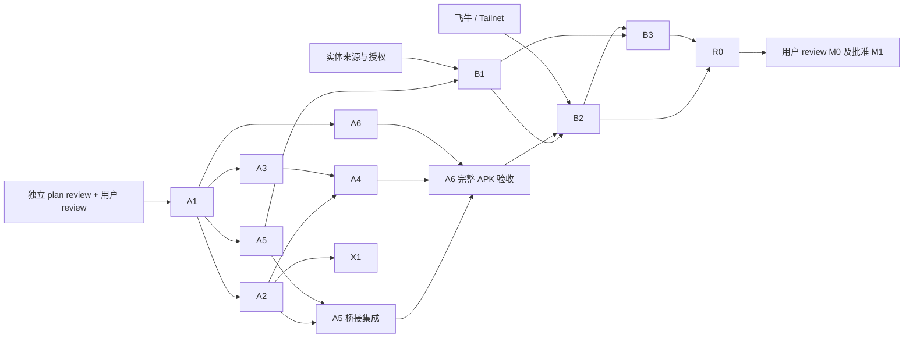

# M0：移动桥接、来源与传输可行性

状态：本轮用户审批的下一执行范围；等待独立 agent plan review、修订阻断项和用户 review。当前不开始代码、设备占用或实验。M0 完成后仍须用户 review 结果并明确批准 M1。

## 目标与当前环境

用隔离探针验证原生来源、单一 Go 移动产物、SMB、tsnet 和真实设备链路，不提前开发完整生产任务引擎。分为 M0A（Linux／CI 实验）和 M0B（真实 Pocket 3 + Pixel 6 Pro + 飞牛）。没有硬件仍完成不依赖硬件的 M0A；M0B 未完成时总状态为未完成。

本轮环境检查：ADB 无设备；JDK 11；Go 1.24.4 在 `/usr/local/go/bin`，未进入 PATH；Android SDK 到 35、NDK 21.1；无 Gradle／gomobile／Xcode。此清单是检查时快照，开工复核。不得把现有工具版本当作足够条件；A1 必须先选择兼容依赖并 bootstrap／固定 JDK、SDK／NDK、Go、gomobile 和 Gradle wrapper。

review 已发现：所检查 go-smb2 提交的普通 `Rename` 会替换目标，最新候选依赖的 Go 要求也高于本机版本。A1／A3 必须依据锁定源码核对，不能以 `latest` 和接口名称推定能力。来源链接和提交证据统一记录到 `docs/platform-evidence.md`。

## 前提与并行方式

| 前提 | agent 可独立推进 | 必须真实具备 |
| --- | --- | --- |
| 构建 | 工具链兼容性、wrapper、锁定依赖、Actions | 可用下载渠道与 CI runner |
| 来源 | 只读 probe 与测试表 | Pocket 3、Pixel 6 Pro、USB-C 数据线、OTG 模式及系统授权；访问方式由用户确认 |
| 大文件 | 协议非稀疏测试数据与流式校验 | 相机上大于 4 GiB 的真实素材，足够手机／NAS 空间 |
| 网络 | 隔离测试 SMB 与可复现实验 | 真实飞牛专用测试目录、限域账号、Tailnet 交互登录及可达策略 |
| iOS | 无平台依赖契约、构建准备 | macOS／Xcode；有设备时做运行 smoke |

不要求用户公开长期密钥，不操作已有设备租约。Dora 若使用须严格遵守 AGENTS 独立租约／cleanup 规则，只证明普通 Android 功能，不能代替 OTG、供电或 Pixel 性能。物理接线／授权需设备持有人配合，其他工作由 agents 执行。

每包单独 issue／分支／worktree，计划和实现分别独立 review。同一文件只有一个 owner；共享构建和 CI 由 Delivery 修改。真机同时只有一个操作 owner，其他 agents 分析日志或实现独立目录。

## 工作包、范围和产物

| ID／owner | 依赖 | 允许文件范围 | 工作与验收产物 |
| --- | --- | --- | --- |
| A1／Delivery | plan review + 用户批准 | `experiments/README.md`、`experiments/toolchains.*`、`docs/validation/m0/environment.md` | 复核环境、bootstrap 并锁定兼容工具链／依赖／ABI；提供命令、版本、剩余前提和源码能力清单 |
| A2／Core bridge | A1 | `experiments/mobile-core/`、`docs/validation/m0/bridge.md` | 构建一个含真实 tsnet／SMB 依赖的 Go AAR，64 位字节计数、文件路径输入、小消息回调；Android 实际加载调用、取消、重开。冻结协议版本／操作 ID／结构化错误／回调线程／取消完成与迟到事件隔离／文件所有权 |
| A3／Core SMB | A1 | `experiments/smb/`、`experiments/test-smb/`、`docs/validation/m0/smb.md` | `net.Conn` 注入、排他临时创建、写入／flush／读回 SHA-256、无覆盖提交、竞争／权限／取消测试。普通 Rename 禁作最终提交；检查是否有公开 no-replace API，否则提出最小适配／维护 fork 方案及源码测试，独立 review 后实施 |
| A4／Core network | A2；SMB 集成等待 A3 | `experiments/tsnet/`、`docs/validation/m0/tsnet.md` | 授权环境下交互登录、持久身份、`Server.Dial` 后同一 Go 内 SMB 使用连接、取消与重建。明确该连接不是原生 socket／FD。验证受保护状态存储，见下文；无测试账号时该部分标未运行 |
| A5／Android source | A1；桥接集成等待 A2 | `experiments/android-source/`、`docs/validation/m0/android-probe.md` | 真正可安装诊断 App：目录选择、只读枚举／完整读取、保存授权、取消、诊断页；集成 Go 调用与手动 LAN／tsnet 实验入口。可先独立完成来源 UI／provider 验证 |
| A6／Delivery | A1；分阶段接入 A2／A5／A4 | `.github/workflows/m0-probe.yml`、`scripts/ci/m0-*` | 从 wrapper／锁定工具链构建真实 arm64-v8a debug probe APK，Go 依赖实际打包；上传 APK、SHA-256、commit／工具链、测试报告。模拟器 ABI 按需补充，必须真正调用 bridge；失败不发布通过结论 |
| B1／Android | A5、实体来源可用 | `docs/validation/m0/pocket3-pixel6pro.md` | Pixel 只读访问 Pocket 3、完整大文件、持久授权、拔线／重连／重启。记录系统／固件／线材／文件系统、字节与摘要。授权不稳定时明确降级为重新选择目录并提交用户 review |
| B2／Core＋Android 集成 owner | A2–A6、B1、飞牛／Tailnet | `docs/validation/m0/fnos-e2e.md` | 完整手机副本 → 真飞牛 LAN 与内嵌 tsnet 两条路径 → 读回 → 无覆盖提交；真飞牛竞争测试，断线／取消、身份重启。加入提交成功但记录前 kill 的对账探针、临时归属和校验失败保留副本验证 |
| B3／Android | B1；完整传输验证等待 B2 | `experiments/android-source/.../lifecycle/`、`docs/validation/m0/lifecycle.md` | 默认离开／返回，接入流程与前台服务合法启动路径。验证可见 Activity／用户通知操作等适用入口；USB attach 和 connectedDevice 声明不视为后台启动豁免。拒绝／停止／超时降级为等待打开 App；未触发场景明确未运行 |
| X1／Core＋Delivery | A2、macOS／Xcode | `experiments/mobile-core/ios/`、`docs/validation/m0/ios-bridge.md` | 同一核心构建 iOS 桥接并 smoke；单一 Go runtime、取消／重开／状态接口证据，有设备再运行。缺环境列未运行，不用 Android 成功替代 |
| R0／独立 Review＋协调 | 必需 A／B 包 | `docs/validation/m0/report.md`、review 记录、必要计划／架构修订 | 复核产物和失败场景，给出通过／失败／未完成、依赖选择、风险及 M1 计划差异，提交用户 review |

A2／A3／A5 原生部分、A6 workflow 骨架和硬件准备可并行。A6 的最终完整 APK 验收等待实际 bridge／实验入口；不能提前用空壳产物声称通过。B1 可在来源 probe 就绪后开展，不必等协议包全部完成。X1 与 Android 实验并行，但缺 macOS 仍必须记录风险供用户接受。

## 安全提交与状态实验细节

SMB 候选必须证明：临时文件以等价 `FILE_CREATE` 的排他语义创建；flush 后读回真实内容；最终提交使用服务端 no-replace 语义。检查版本固定的 API／wire 字段，不能使用 `exists + Rename`。测试同步两个写入者竞争同一路径、目标预存在、取消及连接失败；保留获胜／既有内容且失败方识别冲突。测试 SMB 成功后还要在真实飞牛重复。无可用 no-replace 路线时停止依赖包，提出替代方案供 review。

tsnet 默认文件 Store 不等于加密密钥存储。A2／A4 需选择自有 `ipn.StateStore` 或等效整状态加密，证实 Keystore 支撑的密钥保护、原子持久化、锁屏可用性、备份排除、退出／重新登录语义；不得仅因目录私有就声明节点私钥已加密。iOS 的相应平台存储回调保持独立。私有状态和登录凭据不进入 APK、日志或 git。

大文件协议实验使用非稀疏完整数据并流式摘要；真实来源闭环必须用相机素材。记录 RSS、耗时、字节数和实际机器，实验结果只说明该环境。手机空间至少计入 partial、完整副本和额外参考读取；不能用测试占满用户空间。读回会增加一份完整文件的 SMB 流量，记录实际成本。

## 必须通过的验收

| ID | 通过条件 | 不能替代的证据 |
| --- | --- | --- |
| M0-01 | 实际 Android 加载含真实依赖的 AAR，调用／取消／重开和迟到事件隔离有效 | Linux 编译不能代替 Android 运行 |
| M0-02 | Pixel 读取真实 Pocket 3 授权树，原文件不变，重连／重启授权行为明确 | 云设备／普通 DocumentsProvider 不证明 OTG |
| M0-03 | 大于 4 GiB 的真实素材完整导入且摘要一致；拔线不误报完整 | 合成数据仅补充协议，记录参考摘要来源 |
| M0-04 | Pixel 经 LAN 和 App 内 tsnet 各完成真实飞牛上传／读回一致 | 桌面 Tailscale／系统 VPN 不代替 tsnet |
| M0-05 | 测试 SMB 和飞牛均通过提交时无覆盖及并发竞争 | 大小比较或先查存在不足以通过 |
| M0-06 | 重启复用身份，状态保护与取消／重建可复现，模式无静默回退 | 私有目录不等于已加密 |
| M0-07 | 默认与可选模式的合法启动／停止／失败降级有设备证据 | 理论文档与真机结果分列；关键自动模式不成立须用户 review 范围 |
| M0-08 | Actions 真 probe APK 可下载、校验、安装，commit／ABI 明确 | 构建通过和 Pixel 安装／OTG 通过分开；debug APK 由 debug key 签名，不是正式签名 |

## Review、停止条件和用户 gate

plan review：硬件／账户依赖清楚，真实依赖 AAR／APK 非占位；桥接不假设 FD；no-replace 可证伪；状态加密及生命周期明确；并行文件所有权、凭据隔离和证据范围完整。P1 阻断项解决后用户批准，才进入实现。

impl review：独立 reviewer 检查锁定源码与实际调用、设备／路径归属、真正竞争和大文件、错误恢复、敏感数据与来源只读；重跑关键复现。修订后重跑受影响验收并再次 review。

来源不可访问、移动核心不能加载、tsnet 连接不成立、飞牛无法 no-replace 时暂停依赖节点，提交反例与替代设计；不自行增加 USB／exFAT 驱动、第二个 Go runtime 或弱化完成定义。其他独立节点继续。

最终报告逐项列状态、commit、运行环境、脱敏证据、APK／AAR 哈希、依赖结论、未运行项和需用户接受的限制；M0B 未完成不得宣称 M0 通过。X1 未运行可作为明确 iOS 风险提交用户 review，不得标已验证。M0 验收和用户 gate 后才能开始 M1。
