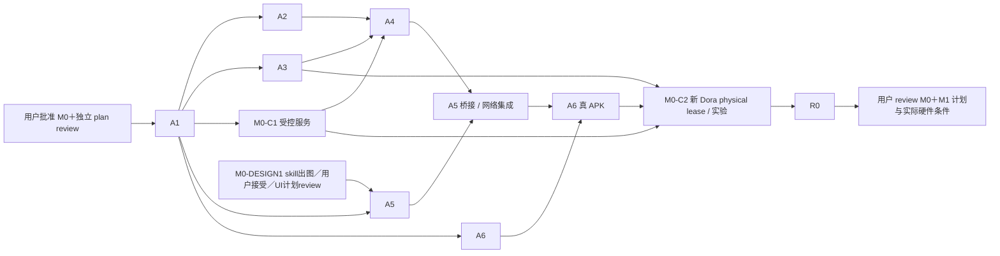

# M0：Android probe、受控 SMB 与 Dora 云端物理设备验证

状态：范围修订提案；独立 review 状态见[本轮审查记录](../reviews/android-first-design-revision-review.md)，M0 实现等待用户明确批准。用户最新决定 iOS 延迟至 M3；M0 仍用 Dora 先验证 SMB，Pocket 真机完整链路在 M0 后；这次范围修订不等于实现批准。历史迁移见[最新修订计划](android-first-design-revision.md)。

## 交付与非目标

交付包含真实 Go／SMB／tsnet 的可安装 Android probe APK、自动构建 Actions、可重复的受控 SMB 实验及 Dora Android **物理设备**上的完整传输证据。连接建立与完整内容传输分别验收。

M0 不要求 Pocket 3、Pixel 6 Pro 或真实飞牛全链路，也不宣称这些组合已验证。构造素材与普通 DocumentsProvider 用于工程验证；Pocket USB 与指定手机兼容性在 M1。M0 不交付生产任务管理或 iOS App；M0–M2 没有 iOS 工程／macOS／iOS签名门槛，iOS 属于 M3。

## 工具与环境前提

2026-10-02 本机快照：ADB 无设备、JDK 11、Go 1.24.4 位于 `/usr/local/go/bin` 且不在 PATH、SDK 到 35／NDK 21.1，无 Gradle／gomobile／Xcode。A1 开工复核，按兼容性固定工具链／依赖，不把现有版本或 latest 当作可用。A1 采用供当前计划 review 的具体标识建议：M0 Android `io.github.ghostflying.ferry.probe`，生产 Android `io.github.ghostflying.ferry`；仅核对 Android 构建约束，iOS 标识／签名留 M3，需更改则记录理由并随计划 review。

同日 Dora 明确 Android＋physical＋idle＋online 查询有候选，仅说明当时池内有候选；尚无租约、APK 安装或服务可达证据。物理设备必须重新查询并占用本会话新 lease。没有合适本地设备时按用户指定 Dora 流程推进；不能改用模拟器宣称云端物理设备验收通过。

受控服务、授权 Tailnet、短期测试 SMB 账号、设备安装与交互登录操作、足够测试空间均待实施时确认。缺条件只阻塞依赖节点；不存在的服务不能以计划文字当作已准备好。

## 工作包与依赖

保留 A1–A6／R0 的原 issue／ID，新增 M0-C1／C2。旧 B1／B2 留 M1，X1 迁 M3，B3 拆分到 M1 前台验收与 M2 自动模式；它们不再是 M0 gate，旧 issue 不标成已完成。

| ID／owner | 依赖 | 文件所有权 | 做什么与产物 |
| --- | --- | --- | --- |
| M0-DESIGN1／Design | 本轮概念授权；视觉实施细节等待用户接受 | `docs/design/` 中 M0 概念／接受记录／后续视觉spec，由design owner维护 | 按指定skill先生成诊断完整主屏及取消／失败等必要状态，用户接受后提取tokens和详细UI计划并独立review；概念不当作运行截图 |
| A1／Delivery | plan review＋用户批准 M0 | `experiments/README.md`、`experiments/toolchains.*`、`docs/validation/m0/environment.md` | bootstrap／固定 JDK、SDK／NDK、Go／gomobile、wrapper、ABI 和候选库；核对版本化源码能力，输出构建命令及依赖清单 |
| A2／Core bridge | A1 | `experiments/mobile-core/`（不提前建立 iOS 子模块）、`docs/validation/m0/bridge.md` | 单一 Go AAR 含真实 SMB／tsnet；小消息与文件路径 API、操作 ID／版本／64 位计数／结构错误／回调线程／取消完成／迟到事件隔离；输出 AAR 与调用测试 |
| A3／Core SMB | A1；集成使用 C1 服务契约 | `experiments/smb/`、`docs/validation/m0/smb.md` | host 现成 `net.Conn` 注入；排他临时创建、flush、读回 SHA-256、服务端 no-replace 和并发竞争；输出可重复测试与候选 API／wire 结论 |
| M0-C1／Network environment | A1 | `experiments/test-smb/`、`docs/validation/m0/network-environment.md` | 准备授权测试 SMB／隔离目录与短期账号，记录服务版本／owner；证明 host 服务可达，准备 Dora 内嵌 tsnet 的授权拓扑／凭据／清理方案；Dora 端实际连通与登录由 C2 在自己的 lease 上证实，C1 完成不代表云端已可达；不接入私人素材共享 |
| A4／Core network | A2；完整集成等待 A3、C1 | `experiments/tsnet/`、`docs/validation/m0/tsnet.md` | 交互登录、受保护 StateStore、原子状态／重启复用；同一 Go 内 `Server.Dial` → SMB；停止／重开与错误分层；输出网络 probe 接口 |
| A5／Android | A1、DESIGN1接受图与UI计划review；桥接集成等待 A2／A4 | `experiments/android-source/`、`docs/validation/m0/android-probe.md` | 真诊断 App：普通目录选择／只读读取、非稀疏测试文件生成、完整本地副本、摘要、手动传输／取消／结果；诊断界面明确“测试素材”，无 Pocket 通过暗示 |
| A6／Delivery | A1；最终 APK 等 A2／A4／A5 | `.github/workflows/m0-probe.yml`、`scripts/ci/m0-*` | wrapper＋锁定工具链从源码构建真实 arm64 debug APK，打包 native core，上传 APK／SHA-256／commit／版本／工具链／测试报告；失败不放行 |
| M0-C2／Device verification | A3、A4、A5、A6、C1、有效新 lease | `docs/validation/m0/dora-android.md`、`experiments/device-harness/` | Dora Android physical 安装／实际 bridge 调用、内嵌 tsnet 到受控 SMB 完整传输、竞争／取消／断线／进程重启与身份复用；finally 清理／撤销／释放并记录验证结果 |
| R0／独立 Review＋协调 | A1–A6、C1／C2 必需验收 | `docs/validation/m0/report.md`、review 记录、必要计划修订 | 独立复核具体 APK／SHA、服务与设备、关键错误实验；明确 host／Dora／未测 USB 的证据边界，提交 M0 结果与 M1 条件给用户 review |

A2／A3／C1／A6 workflow 可在 A1 后并行，A5 UI须额外等待DESIGN1；共同构建配置单 owner。C1 可先在 host 验证，Dora 可达性须在 C2 自己的 lease 上证实。C2 同时仅一个 agent 操作设备，其他 agents 改各自模块，不能共用租约。每包先书面细化与独立 plan review，再实现和独立 review。

## 受控网络、数据与凭据

C1 必须先明确服务 owner、服务器版本、隔离测试共享、限域短期凭据、配额、允许流量、撤销和自有文件清理方式。host 直连只在受控私网进行；Dora 不默认与 host／家庭 NAS 同网。优先让授权测试服务器加入测试 Tailnet，App 内 tsnet 登录后连接 TCP 445；确认登录所需控制连接和服务路由／访问策略分别可达。

M0 的必需路径为 **host 直连 API／SMB 实验**与 **Dora App 内 tsnet → 受控 SMB 完整传输**。Dora 直接 SMB 仅在已批准私网／隧道真实可达时补测，不是 M0 必需项；未测不能说 Dora LAN／tsnet 双路径通过，也不能为了可达性无限制暴露公网 445。不用系统 Tailscale VPN 或桌面传输替代 App 内 tsnet。

凭据只通过保护存储和临时 secret 引用注入，不写 APK、git、截图或公共日志；不共用长期 auth key。测试使用可复现构造文件，记录字节数与生成后参考 SHA-256，包括大于 4 GiB 的**非稀疏**文件。开始前确认可用空间和配额；不足则换新合适 lease 或阻塞相关验收，不侵占他人设备。结束撤销测试节点／账号并删除本任务素材／状态，私密清理失败立即报告，不能写成完成。

SMB 普通 `Rename` 不得用作最终提交；版本化源码必须证明 server no-replace。排他临时创建、flush／读回、两个写者同步竞争、预存在目标均可复现；既有完整字节不变，失败方明确冲突。无公开 API 时先提出小范围适配／维护 fork 计划供 review，不能用 exists＋rename 替代。

tsnet 的 `net.Conn` 只在同一 Go runtime 内使用，不转为原生 FD。默认私有 Dir 不等于加密；采用自有 `ipn.StateStore` 或等效整状态加密，验证 Keystore 支撑、原子写、备份排除、锁屏可用性和退出／重登。记录 RSS／耗时但不以云设备推断 Pixel 性能，不承诺尚未约定的性能阈值。

## Dora session 隔离与清理

按上级 AGENTS 使用 `auth status`、显式 `--os android --device-type physical` 的新 idle／online 查询。占用后同时 `device get` 和 occupied list，保存 serial／session ID／endpoint 的私有会话记录。每次连接、ADB 操作、续租或释放前重新 `get` 并核对 session ID；不匹配／缺失即停止操作。

连接后实际确认 OS／API／ABI、网络、安装和启动。自动化用 `trap`／`finally`，停续租进程后只释放仍匹配的本会话 lease，并确认不再出现在 occupied 列表。租期结束前完成应用测试数据／账号清理；不接管先前已占用设备，即使属于当前用户。公开报告仅用脱敏设备代号和系统／ABI。

## 验收矩阵

旧 M0-01–08 在旧提交中定义；本次用 M0-V01–V10，避免把旧 Pixel／飞牛验收静默改成云端通过。旧硬件要求迁到 M1 验收。

| ID | 环境与可重复动作 | PASS 结果 | 产物／证据及阻塞 |
| --- | --- | --- | --- |
| M0-V01 | 干净 runner 按锁定工具链构建 probe | 真 APK 内含 AAR，失败检查使 CI 失败，下载哈希一致 | Actions／commit／APK／SHA-256／ABI；缺工具链或构建失败则 FAIL／BLOCKED |
| M0-V02 | 新 Dora Android physical lease 安装并调用桥接，再取消／重开 | 安装启动、64 位进度与结果正确；旧操作迟到回调不完成新操作 | 安装／调用日志；无有效 lease 或 ABI 不符不能通过 |
| M0-V03 | host 受控 SMB 经注入 net.Conn 完整上传／flush／读回 | SHA-256 与已知输入一致；拒绝凭据／权限时明确错误 | 服务版本／客户端锁定提交／字节与摘要；不代表 Dora 直连 |
| M0-V04 | Dora App 内 tsnet 登录并访问 C1 服务 | SMB 会话成功且完整上传／读回一致；不是只建立 TCP | 脱敏路径／登录状态／字节／摘要；网络不可达则 BLOCKED，不跳过 |
| M0-V05 | Dora 上传非稀疏 >4 GiB 构造文件，读回摘要 | 字节和完整 SHA-256 一致，进度不溢出 | 文件生成参数／参考摘要／远端摘要；空间不足未运行，不以小文件代替 |
| M0-V06 | host 与 Dora 路径测试预存目标及同步竞争 | 提交拒绝覆盖，既有／胜出内容完整不变，失败方报告冲突 | 同步点／结果／完整摘要／no-replace API证据；不能 exists＋rename |
| M0-V07 | 传输取消／服务侧断线／进程终止后重启 | 不误报已完成，保留本地完整副本；身份复用、可重新连接／文件级重试；提交后记录前中断可对账 | 故障注入／状态与文件归属日志；清理只影响自有对象 |
| M0-V08 | 普通 provider 授权／读取，离开前台／返回；检查状态文件保护 | 来源只读，退出停止新操作，回归可重建；持久状态不以明文默认 Store 冒充加密 | 普通来源／生命周期／存储测试；无 Pocket 或自动模式结论 |
| M0-V09 | 清理测试文件／节点／账号并释放匹配 lease | 记录清理结果、occupied 中本 lease 消失；报告全部范围和未运行项 | 脱敏 cleanup 证据；失败或失去 lease 时停止后续设备操作并报告 |

## UI 设计与视觉验收

所有probe可见UI先按 `build-web-apps:frontend-app-builder`／Image Gen生成完整screen与所需状态，经用户接受后才提取tokens／具体组件／详细UI实施清单，再独立review；本计划仅规定功能与错误语义。构造数字标明设计fixture，不代表真实运行。接受图不批准应用实现。

| ID | 动作 | PASS与证据 | 阻塞 |
| --- | --- | --- | --- |
| M0-V10 | 在实际Android probe捕获接受图对应状态，用view_image检查概念与native截图 | 至少文案、层级、字体、颜色、间距／容器五项比对，记录可见文案diff／fidelity ledger；取消／失败可真实操作 | 未接受图或视觉细节未review不得实现UI；概念不能代运行截图，Browser QA不代native验收 |

## 两轮 review、停止与用户 gate

plan review 检查受控服务并非假定存在、host／Dora 路径分开、凭据最小范围、no-replace 可证伪、真实 APK、session 隔离与失败清理。impl review 在具体 SHA／产物上复核并重跑关键场景，不沿用旧范围的 PASS。

构建／桥接不成立、Dora 到服务不可达、无有效物理 lease、无法 no-replace、身份状态不受保护时暂停依赖节点并记录反例；其他独立节点继续。不得扩展公网访问、冒用旧 lease 或降低内容校验来凑通过。

V01–V10 必需项通过、独立审查完成后可报告“**M0 受控协议实验通过**”，同时列清未测的 Pocket／Pixel／iPhone／真实飞牛和 Dora 直连。提交 APK、证据、未决项和 M1 Android／真实硬件条件给用户；只有明确批准 M1 才开始其实现或 Pocket 完整链路测试。
