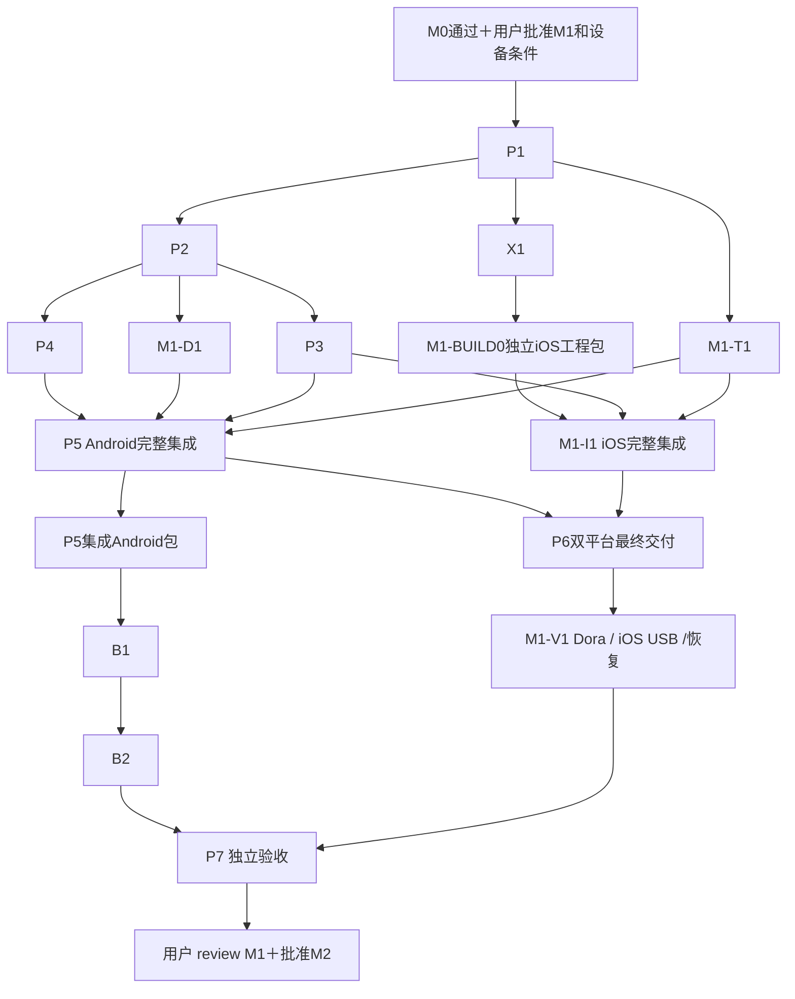

# M1：Android 与 iOS 可用前台基础版

状态：落实用户“iOS 移入 M1”的具体范围提案，尚待用户 review。M0 的受控协议验收和用户明确批准本计划之后才能实现。M0 结束时一并确认 Pocket／Pixel／iPhone／飞牛、macOS／Xcode 和 iOS 签名条件，不能把本轮修订视作批准。

## 要做的事情与产物

交付 Android Compose 与 iOS SwiftUI App，均可配置来源／目标／规则，前台打开后只读导入完整手机副本，经明确选择的 LAN 或内嵌 tsnet 上传 SMB，读回 SHA-256 后无覆盖提交，持久化任务与人工暂停，离开前台停止／返回恢复系统等待。任务页真实区分导入／上传／校验／等待／失败；无证据不能完成。

交付 Android Actions APK，以及 macOS／Xcode 构建、具有效签名／安装路径的 iOS 验证包；都绑定 commit／版本／哈希及安装证据。无签名 archive 或 simulator 产物不能代替 iOS 物理设备安装。

包括真实 Pocket 3 → Pixel 6 Pro／iPhone 17 Pro USB-C → 飞牛的逐路径验收。Dora Android／iOS 物理设备可验证普通目录、规则、网络和生命周期，不能证明 Pocket USB。Android 自动接入／FGS 留到 M2，M1 不显示可用自动模式开关。OpenDAL／网盘不在本阶段。

## 前置决定与共同契约

Apache-2.0 已确认；本计划建议 Android applicationId／iOS bundle ID 为 `io.github.ghostflying.ferry`（M0 probe 为 `io.github.ghostflying.ferry.probe`），P1 记录该具体建议及系统版本，随用户计划 review 确认；不另将常规包名选择悬为无建议的阻塞。最低／目标系统版本按锁定工具链确认。iOS macOS runner／Xcode 版本、证书／profile／设备注册或其他合法安装途径必须实际可用，密钥只经受保护的 secret 引用提供。无法安装则 iOS 验收阻塞，不能用“接受 iOS 风险”把双平台 M1 标成通过。

P1 冻结以下接口后各实现包并行：

- 配置 v1、未知版本／字段拒绝、引用／范围校验和字段级错误；原样读取现有示例但占位目录／凭据保持未绑定。
- first_match、排除优先、目录边界、时区／缺失时间、长名／非法路径、完整哈希模板；未知 SHA-256 只做待内容确定预览，导入完整后才冻结目标路径。
- 原生数据库事务、不可变配置／目标 revision、操作意图／阶段／人工暂停／系统等待；开始外部操作前先落意图，提交完成后再持久完成。
- 单一 Go 产物承载规则／SMB／tsnet；native URI、Context、bookmark 不泄漏到核心；只传文件路径和小消息，不把 net.Conn 当原生 FD。
- 协议版本／操作 ID／结构错误／回调线程／64 位字节计数／取消完成／迟到事件隔离、平台保护存储回调与文件所有权。
- 来源 adapter／spool／任务 repository／transport／UI 的 DTO 和单 owner；source 引用只是逻辑绑定，不冒充相机认证身份。

## 文件所有权、任务和产物

保留原 P1–P7，迁入历史 B1／B2／X1；新 BUILD0／D1／I1／T1／V1 均使用完整 M1 前缀。P4、P5 仍仅 Android；iOS 对应实现集中 I1，避免多个 agents 写同一目录。M1-BUILD0 是独立 ID／issue 的先行 Delivery 包，提供可构建的 iOS 工程／最小入口后，把应用入口所有权交给 I1，构建／CI 配置交给最终交付 P6；移交前后同一文件均单 owner。I1 不依赖 P6，P6 的双平台最终验收等待 I1，因此实际 task／issue DAG 无环。Android 阶段产物由 P2 构建链在 P5 集成后产生，B1／B2 不等待 P6 双平台最终交付。

| ID／owner | 依赖 | 文件范围 | 工作与产物 |
| --- | --- | --- | --- |
| P1／协调＋接口 authors | M0 通过＋用户批准 M1 | `docs/contracts/`、`docs/validation/m1/environment.md` | 固定共同配置／状态／来源／存储／桥接接口，列平台和硬件条件；独立 plan review |
| P2／Delivery | P1 | Android Gradle／wrapper／Manifest；`scripts/build-android.*`、Go module 初始配置 | 正式 Android 骨架与唯一核心构建接线、版本／ABI；可安装基础 APK |
| X1（原 M0-X1 #12）／iOS bridge | P1、可用 macOS／Xcode | `experiments/mobile-core/ios/`、`core/mobile/iosbridge/`、`docs/validation/m1/ios-bridge.md` | 同一核心 XCFramework／等效单 runtime 产物，取消／重开／受保护状态回调 smoke；确认签名安装路径后才宣称运行 |
| M1-BUILD0／Delivery bootstrap | P1、X1 | `ios/` project／workspace、`ios/Ferry/App.swift` 最小入口、iOS构建脚本与CI初始配置 | 建可构建并调用X1核心的iOS壳，验证工程／安装配置；完成后入口移交I1，构建配置移交P6，记录SHA与owner移交；不宣称产品功能完成 |
| P3／Core rules | P1、P2 Go module | `core/model/`、`rules/`、`planner/`、`mobile/contract/`、`fixtures/rules/` | 配置解析、确定性规则／计划和平台共享向量；核心 API，实际被两平台调用 |
| P4／Android state | P1、P2 | `android/app/src/main/.../data/`、`model/`、`security/`、对应测试 | Room schema／事务／revision／暂停／恢复意图，Keystore凭据和StateStore适配；提供 repository 接口，不写 spool/UI |
| M1-D1／Android source | P1、P2；持久集成等 P4 | `android/app/src/main/.../source/`、`spool/`、对应测试 | SAF 授权／完整只读导入、流式哈希／容量预留／partial提交／启动对账；提供 source/spool 接口 |
| P5／Android UI＋coordinator | P1、P2；完整集成等 P3／P4／D1／T1 | `android/app/src/main/.../ui/`、`navigation/`、`lifecycle/`、`execution/`、`res/` | 四页、规则预览、实际导入／上传／校验、人工暂停、前台协调和错误展示；不写 data/source/spool |
| M1-I1／iOS native | P1、X1、M1-BUILD0；完整集成等 P3／T1 | `ios/Ferry/App.swift`（BUILD0完成后移交）、`ios/Ferry/Source/`、`Spool/`、`Data/`、`Security/`、`UI/`、`Lifecycle/`、`Execution/`、对应测试 | SwiftUI 可用 App、security-scoped bookmark／协调读取、完整副本、SQLite、Keychain／加密StateStore、前台调度和真实共享核心调用；不改 P6 project／CI 配置 |
| M1-T1／Core transport | P1、M0 A3／A4；模型集成等 P3 | `core/storage/`、`core/network/`、`core/mobile/transport/`、对应测试 | 生产 LAN／tsnet 连接、认证／错误、临时所有权、读回／no-replace、取消／对账与文件级恢复；调用平台保护存储接口，不实现平台数据库 |
| P6／Delivery final | P2、M1-BUILD0、P5、I1；接收构建配置所有权 | `.github/workflows/android.yml`、`ios.yml`、`ios/` project／workspace／签名配置模板、`scripts/ci/`、`docs/build-android.md`、`build-ios.md` | 双平台源码构建／测试／真实产物、签名安全与安装步骤；公开无秘密构建报告，受限 iOS 安装按批准渠道提供 |
| B1（原 M0-B1 #9）／Android hardware | D1、P5集成的可安装Android产物、用户硬件条件 | `docs/validation/m1/pocket3-pixel-source.md` | Pocket／Pixel 来源、>4 GiB真实素材、授权／拔线／重连／重启；不写原探针代码 |
| B2（原 M0-B2 #10）／Android e2e | B1、T1、P5集成的可安装Android产物、真实飞牛 | `docs/validation/m1/pixel-fnos-e2e.md` | Pixel 上 LAN／App tsnet 两路径完整素材、飞牛no-replace、取消／提交后kill对账 |
| M1-V1／device verification | P5、I1、P6；完整报告等 B1／B2与iOS硬件 | `docs/validation/m1/ios-e2e.md`、`recovery-matrix.md`、`device-leases.md`、独立验收脚本 | Dora 新 Android／iOS物理lease普通流程、两平台前台恢复；Pocket／iPhone17 Pro／飞牛两路径USB闭环；汇总三类来源分开的证据 |
| P7／独立 Review＋协调 | P3–P6、X1、BUILD0／D1／I1／T1／V1、B1／B2 | `docs/validation/m1/report.md`、review记录、M2计划修订 | 在最终SHA和双平台产物上独立审查／验收，向用户提供结果、未测和下一阶段范围 |

X1 与 P2／P3／P4／D1／T1 可在 P1 后按接口并行；P5／I1 可先搭建独立界面，但不能以 mock 验收。T1、Android、iOS 通过冻结合同集成，每个平台唯一执行协调器负责意图持久化和回调落盘。依赖 PR 串行合并可构建基础，再合并使用者并重跑受影响验收。

## 双平台行为与故障条件

完整副本使用持久私有目录、排除云备份、partial 文件和流式 SHA-256。空间预算包含 partial／完整／保留副本和并发预留；未知大小受运行时上限，单文件超过 max_bytes 等待空间，不自动改流式直传。拔线或源变化不把半文件标完整；没有可靠版本信息时重新读哈希，明确可能再次占用导入空间。

上传排他临时创建、写入／flush／读回、无覆盖提交。已有同内容复用须有内容证据；不同内容不覆盖；提交后记录前kill先对账，自有临时文件才可清理。校验失败保留本地，完成记录持久化后按保留策略释放。读回增加一份完整 SMB 流量，完成只证明所测时刻内容，不保证其他 NAS 写者后续不修改。

离开前台停止新工作并取消／收尾当前操作，保存后下次打开恢复；人工暂停始终保持。iOS 锁屏／挂起之后重建 socket 和访问引用；bookmark 失效要求重新授权。Android SAF 重连授权不稳定时明确降级为重新选目录，兼容矩阵和用户 review 包写清，不能悄悄弱化体验。

Dora 新租约遵守[ M0 session 隔离流程](m0.md#dora-session-隔离与清理)，iOS 必须显式 iOS＋physical 查询并验证 session，安装前确认签名适用设备／系统。Dora普通文件与网络结果不放入Pocket兼容性通过列。

## 可判定验收矩阵

本次使用 M1-V01–V12，旧 M1-01–09 保留在历史版本中。每行报告平台、源码SHA、包哈希、系统／ABI、输入、动作、预期／实际和 PASS／FAIL／BLOCKED／NOT_RUN。

| ID | 测试环境与动作 | PASS结果 | 证据／失败或阻塞 |
| --- | --- | --- | --- |
| M1-V01 | 干净Linux／macOS runner构建Android与iOS；下载后验证哈希并安装 | 两个真实App可启动并调用唯一Go核心；iOS有效签名／安装路径可复现 | CI／commit／包／版本／哈希／安装日志；缺macOS或签名阻塞iOS，不以archive替代 |
| M1-V02 | 两平台读现有配置，输入未知版本／字段／坏引用；执行共同向量 | 有效配置可保存，无效配置拒绝且字段错误明确；两平台规则结果一致 | Go向量、两端实际bridge结果；mock不算 |
| M1-V03 | 修改规则／目标后结束进程再启动；检查创建前后任务 | 配置和人工暂停保留；旧任务仍指旧revision，不重定位 | 原生数据库事务／重启测试；破坏式回退或状态丢失失败 |
| M1-V04 | 普通provider及真实USB各执行读取中拔线／取消／进程结束 | 不完整副本不可上传；原文件不变；恢复先对账 | 来源／partial／状态证据分别列；云provider不代USB |
| M1-V05 | 空间不足、未知size、单文件超上限、保留副本占预算 | 开始前或达到运行时上限停止并等待空间；不清未完成副本；空间释放后可恢复 | 可控容量测试与状态；不实际填满用户存储 |
| M1-V06 | Pocket→Pixel→飞牛LAN和App tsnet各导入／传>4GiB真实素材 | 手机／远端完整摘要一致，完成记录落盘，源不变 | B1／B2真机／线材／固件／摘要；缺设备或NAS则未完成 |
| M1-V07 | Pocket→iPhone17 Pro USB-C→飞牛两条路径做同样流程 | security-scoped访问与完整副本／远端摘要通过，源不变 | V1真实USB证据；Dora不能替代，Lightning不在范围 |
| M1-V08 | 测试服务和飞牛上预存不同内容、并发提交、重复连接 | 既有内容不覆盖，失败方冲突；同内容经证据复用，不重复产生完成任务 | 竞争同步点／摘要／任务状态；exists＋rename失败 |
| M1-V09 | 两平台注入断网、校验不一致、写完或提交后记录前kill | 不冒报完成，副本保留；重启对账后复用或文件级重传，只清自有临时对象 | 故障矩阵／远端文件／数据库记录；误删或误完成失败 |
| M1-V10 | 两平台离开、锁屏／挂起、返回；人工暂停后重启 | 离开停止新操作；返回重建并恢复系统等待；人工暂停不解除，无迟到事件串任务 | Dora普通流程＋指定手机实测，系统版本／日志；未触发场景明确未运行 |
| M1-V11 | 登录后重启、退出／重登；检查备份配置、状态文件和导出 | 复用安装身份，退出行为符合契约；无明文默认Store冒称加密；导出不含秘密；网络方式无静默回退 | 平台安全适配／脱敏身份比较／导出测试；密钥泄露停止 |
| M1-V12 | 跟随使用文档完成配置、预览、导入、上传、校验和暂停 | 四页可用、真实阶段与错误可见；无假完成，无自动模式可用承诺；Dora清理并释放已核验lease | 操作记录／截图／cleanup；缺任何规定验收则整体未通过 |

## 独立 review 与用户关口

每复杂包先 review 计划与冻结接口，再实现和独立 review；最终 P7 在最终产物重跑关键链路。审核文件owner、平台边界、no-replace／空间／状态、签名和凭据、数据恢复与证据归属。

缺 macOS、iOS安装签名、有效 Dora lease、指定 Pocket USB 组合或真实飞牛时，只推进独立节点；受影响项 BLOCKED／NOT_RUN，不能宣称完整 M1 通过。若用户选择接受受限版本，须另行明确修改范围、独立审查及用户决定；当前不包含此豁免。

向用户提交双平台可安装产物／哈希、CI／PR／commit、所有验收行、真实兼容矩阵、限制和 M2 计划。只有用户 review M1 并批准 M2，才启动可选自动模式工作。
