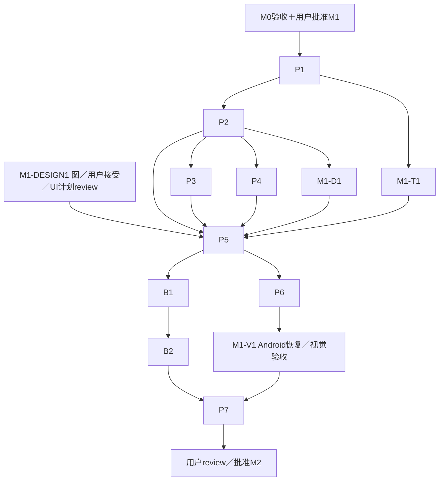

# M1：Android 可用前台基础版与 Pocket 完整链路

状态：Android 优先修订提案，[独立审查状态](../reviews/android-first-design-revision-review.md)与用户实施批准分别记录。M0验收并获用户明确批准M1后才能实现；本阶段没有iOS工程／macOS／Xcode／iOS签名或双平台回归前提。此前双平台M1已被最新决定替代，历史issue／review保留原范围。

## 任务与实际产物

交付 Kotlin／Compose Android App：配置来源／目标／规则，打开App后只读导入完整手机副本，经明确选择的LAN或内嵌tsnet上传SMB，读回SHA-256后无覆盖提交，持久化任务与人工暂停，离开前台停止／返回恢复系统等待。任务真实区分导入／上传／校验／等待／失败，无内容证据不能完成。

交付Actions真APK、完整源码SHA／版本／ABI／SHA-256、安装和Pixel／Pocket／飞牛实测报告。Android自动接入／FGS在M2，M1不显示可用自动模式开关。iOS桥接／工程／UI／保护存储在M3才开发；共享Go保持正常平台边界与规则向量，不为了未来iOS预建通用平台框架。

## 前置决定与功能契约

Apache-2.0已确认。Android applicationId建议 `io.github.ghostflying.ferry`，probe后缀 `.probe`；最低／目标SDK和ABI随锁定工具链及用户review确认。真实Pocket／Pixel／飞牛操作条件在M0结束的用户关口明确。

P1只冻结当前Android实际需要的功能契约，不冻结视觉细节或未实现iOS接口：

- 配置v1／字段校验／错误定位，原样读取示例但占位授权和凭据不当可用。
- first_match、排除优先、大小写、目录边界、时区／缺失时间、长名／非法路径与完整哈希；未知哈希仅待内容确定预览，完整导入后才冻结路径。
- Room事务、不可变目标revision、操作意图／阶段／人工暂停／系统等待；外部操作前落意图，确认提交后落完成。
- Android原生URI／Context不进Go，文件路径和小消息跨bridge；net.Conn留同一Go runtime内，实际操作使用版本／ID／结构错误／回调线程／64位计数／取消完成／迟到事件隔离。
- source／spool／repository／transport／执行协调器的当前输入输出与单owner。凭据和节点状态按Android Keystore保护；不预制iOS回调／平台服务层。

## UI 先出图，随后才有视觉实施计划

M1-DESIGN1由design agent使用 `build-web-apps:frontend-app-builder`／Image Gen覆盖任务、来源、目标、规则及必要首次使用、暂停、完成、权限／空间／中断状态。数量按可读性决定，6–7张是当前Android整体概念的估算而非上限。功能brief不预设布局、tokens或组件几何。

用户接受对应概念后才提取tokens／组件清单／可见文案／详细UI实施计划，并独立review。P5 UI实现同时要求M1实施批准和该设计关口通过。已批准的非UI核心／状态／传输工作可以独立进行。概念中的fixture不作测试通过证据；原生UI最终对照接受图，不能交付截图充当App。

## 工作包、所有权和依赖

P1–P7保留原ID／issue，职责切回Android；M1-V1保留 #28并迁出iOS部分至M3-IOSV1。历史M0-X1 #12、M1-BUILD0 #24、M1-I1 #26迁M3，不作为本表任何前置。B1／B2保留历史ID和 #9／#10。

| ID／owner | 前置 | 文件范围 | 做什么／产物 |
| --- | --- | --- | --- |
| M1-DESIGN1／Design | 当前Android概念授权；细节等待用户接受 | `docs/design/` M1概念／状态／接受／后续spec | skill先图，接受后tokens／详细UI计划；记录接受范围，不把M0图自动当M1图 |
| P1／contracts | M0通过＋用户批准M1 | `docs/contracts/`、`docs/validation/m1/environment.md` | 冻结上述Android功能／数据契约、硬件前提与独立plan review |
| P2／Delivery bootstrap | P1 | Android Gradle／wrapper／Manifest、Go module配置、`scripts/build-android.*` | 可构建Android骨架／AAR接线、版本ABI、可安装基础APK；不设计未经接受的可见界面 |
| P3／Core rules | P1、P2 | `core/model/`、`rules/`、`planner/`、`mobile/contract/`、`fixtures/rules/` | 实际配置解析、确定性规则和路径计划、Android调用；保留规则向量 |
| P4／Android state | P1、P2 | `android/app/src/main/.../data/`、`model/`、`security/`、测试 | Room schema／事务／revision／暂停／恢复意图、Keystore凭据／StateStore；不写UI或spool |
| M1-D1／Android source | P1、P2；持久集成等P4 | `.../source/`、`spool/`、测试 | SAF只读完整导入、流式哈希／空间预留／partial提交／启动对账 |
| M1-T1／Core transport | P1、M0 A3／A4；模型集成等P3 | `core/storage/`、`network/`、`mobile/transport/`、测试 | 生产LAN／tsnet、错误／临时所有权、读回／no-replace、取消／对账／文件级恢复，Android实际保护存储接入 |
| P5／Android UI＋executor | P1、P2、DESIGN1接受及UI计划review；最终等P3／P4／D1／T1 | `.../ui/`、`navigation/`、`lifecycle/`、`execution/`、`res/`、测试 | 按接受图实现功能入口／状态并接真实核心；单一前台执行协调器。详细视觉清单在图被接受后补，不在本表提前指定 |
| P6／Delivery final | P2、P5最终集成 | `.github/workflows/android.yml`、`scripts/ci/`、`docs/build-android.md` | 干净runner实际构建／测试／APK、版本／哈希／安装步骤；没有iOS依赖 |
| B1（M0-B1 #9）／hardware | D1、P5集成Android包、硬件 | `docs/validation/m1/pocket3-pixel-source.md` | Pocket／Pixel来源、>4GiB真实素材、授权／拔线／重连／重启 |
| B2（M0-B2 #10）／e2e | B1、T1、P5包、真实飞牛 | `docs/validation/m1/pixel-fnos-e2e.md` | Pixel经LAN／App tsnet两路径完整上传、飞牛竞争与提交后kill对账 |
| M1-V1 #28／verification | P5、P6最终包；完整报告等B1／B2 | `docs/validation/m1/android-recovery.md`、`visual-fidelity.md`、验收脚本 | Dora Android新lease一般流程、Pixel前台／恢复、native截图与接受图对照；不含iOS验收 |
| P7／独立Review＋协调 | P3–P6、D1／T1／V1、B1／B2 | `docs/validation/m1/report.md`、review记录、M2计划修订 | 最终SHA／APK独立审查与关键重跑，给用户Android产物／限制／下一阶段计划 |

P3／P4／D1／T1可在接口／骨架满足后分目录并行；P5不得用mock通过验收。共享构建配置P2完成后明确移交P6，无双向依赖。B1／B2可用P5集成包提前测试，最终P7在最终SHA重跑受变更影响的关键路径。

## 数据完整性与运行行为

完整副本存私有持久目录并排除备份；partial、完整、保留副本与并发预留一起核算空间。未知size运行时上限、单文件超过max_bytes等待空间，不改直传；拔线或源变化不能标完整。版本信息不可靠时重新读哈希，说明重复扫描可能占用导入空间。

SMB排他临时创建、flush／读回、服务端no-replace；同内容复用有内容证据，不同内容不覆盖。提交后记录前kill先对账，只清本任务临时对象；校验失败保留本地，完成持久后才按策略释放。完成仅证明所测时刻内容，不保证其他NAS写者随后不改。

离开前台停止新操作并取消／收尾、保存；返回恢复系统等待，人工暂停保持。SAF重新挂载失效则要求重选，并在兼容矩阵列明。Dora按M0新session隔离与finally cleanup，普通provider不代替Pocket USB。

## 可判定验收

此次矩阵限定Android；历史双平台Vxx保留在旧SHA，不继承通过。每行绑定最终SHA／APK哈希、环境、输入、动作、预期／实际及PASS／FAIL／BLOCKED／NOT_RUN。

| ID | 环境／动作 | PASS结果 | 证据与未通过条件 |
| --- | --- | --- | --- |
| M1-AV01 | 干净Linux runner源码构建、下载校验、Pixel安装调用Go | 真APK运行，版本／ABI／摘要与报告一致 | CI／包／安装日志；构建不代功能 |
| M1-AV02 | 实际App读示例／坏版本字段引用，执行规则向量 | 正确保存／预览；无效输入字段级拒绝；hash未知不伪造目标路径 | parser／bridge／UI结果，mock不算 |
| M1-AV03 | 配置修改后kill重启、检查新旧任务 | 配置／人工暂停保留，旧任务引用旧revision且不重定位 | Room事务／数据库／重启结果 |
| M1-AV04 | 普通provider及Pocket读取中拔线／取消／kill | 源未修改，不完整副本不能上传，重启先对账 | 普通／USB分列；缺USB未通过该项 |
| M1-AV05 | 容量不足、未知size、超单文件上限、保留副本占用 | 等待空间，不清未完成副本；条件恢复后可继续 | 可控预算测试，不填满用户存储 |
| M1-AV06 | Pocket→Pixel→飞牛LAN和App内tsnet各传>4GiB真实素材 | 手机／远端完整SHA-256一致，完成落盘且源不变 | 线材／固件／系统／字节摘要；缺真实设备/NAS阻塞 |
| M1-AV07 | 飞牛预存不同内容／并发提交／重复连接 | 不覆盖既有／胜出内容，冲突可见；同内容有证据复用，无重复完成 | 竞争同步点／摘要／任务记录 |
| M1-AV08 | 断网、校验不一致、写完或提交后记录前kill | 不误完成，副本保留；重启对账／重试，只清自有临时 | 故障矩阵，误删或误完成FAIL |
| M1-AV09 | 离开／锁屏／返回，人工暂停后重启 | 离开停止新工作，系统等待可恢复，人工暂停不解除，迟到回调不串任务 | Dora普通+Pixel实测；未触发场景如实未运行 |
| M1-AV10 | 登录重启、退出／重登、检查状态／备份／导出 | 安装身份按契约复用／退出，Keystore保护，无秘密导出或网络静默回退 | 脱敏状态比较／保护存储测试 |
| M1-AV11 | 按接受图对应状态捕native截图，用view_image对照并操作主要流程 | 文案／层级／字体／颜色／间距等≥5项通过，copy diff／fidelity ledger完整；控件真实生效，无假完成 | 未接受设计不能进入视觉实现；概念不是运行截图，Web QA不代native |
| M1-AV12 | 独立按文档配置／预览／导入／上传／校验／暂停，再核清理 | 真实流程可复现，未实现自动模式不冒称可用；Dora自有lease清理释放 | 操作说明／截图／cleanup／最终报告；必需项未测则未完成 |

## 独立 review、停止与用户 gate

每复杂包先review功能计划；UI另需接受概念后的详细视觉计划，再实现与独立review。最终审查检查文件owner、Android实际边界、空间／no-replace／事务／恢复、凭据、视觉与功能证据分别成立。

缺Pocket／Pixel／飞牛或有效设备操作条件只暂停依赖节点，不用Dora模拟替代指定USB；不引入iOS环境来阻塞本阶段。任何范围豁免需用户明确决定及重新review。提交APK／hash／CI／PR／SHA、逐项Android验收、接受图／截图对照、限制和M2计划；用户批准M2后才进入自动模式与Android发行准备。
