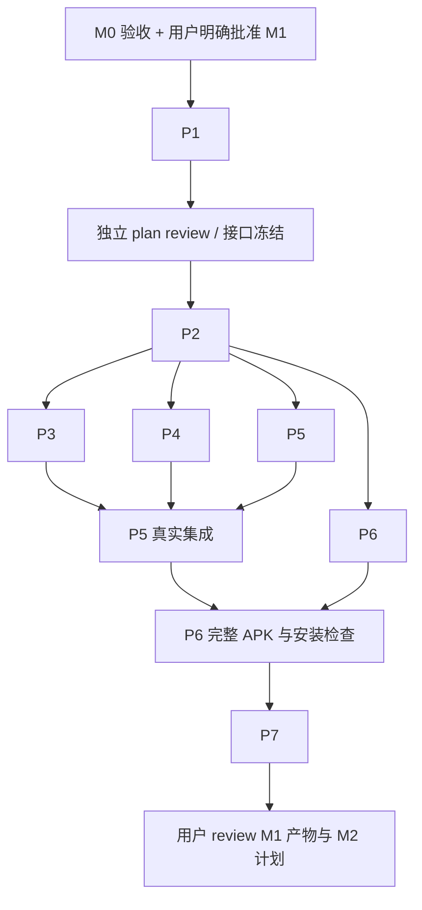

# M1：可安装 Android App、规则与持久状态

状态：本轮提前 review 的候选方案；M0 必需验收及用户明确批准下一阶段之前，不开始 M1 实现。M0 结论改变本计划时需重新独立 plan review，并向用户说明差异。

## 交付与边界

交付真正可安装的 Kotlin／Compose App：来源／目标／规则／任务页、配置保存、Go 规则预览、原生 Room 持久状态、不可变目标快照和人工暂停。Actions 从源码构建真实 APK，提供哈希／commit／工具链和安装启动证据。

M1 不实现真实媒体导入、生产 SMB 传输、tsnet 登录连接或可选自动服务，分别在 M2／M3／M4 实现；相关入口显示未实现。M0 探针隔离，不直接包装成已完成产品能力。fixture 仅存在测试或明确标记的预览，不产生虚假成功任务。

原生层持有授权引用、数据库、生命周期与凭据引用；Go 负责平台无关的规则／计划。App 必须调用真实 Go 规则实现，不能用 Kotlin 重写或空桥接绕过共享核心。

## 开工前契约

按 M0 结论锁定工具链、SDK／ABI 和桥接方案。许可证已由用户确认为 Apache-2.0。应用标识仍待 A1 提出建议并由用户在计划 review 时确认；若尚未确定，先提出实验标识供 gate review，不静默当成正式身份。

- JSON `schema_version = 1`，拒绝未知版本／字段和无效引用，错误包含字段路径；现有示例由实际解析器读取。
- 输入包含相对路径、大小、修改时间／缺失标记和可选 SHA-256。未知哈希只能产生待内容确定的预览，不能伪造完整目标路径或创建已冻结上传任务。M2 完整导入后才获得真实摘要。
- 保持产品已定义的 first_match、排除优先、扩展名大小写、目录边界、缺失时间／时区、完整哈希模板和非法／过长路径规则。
- 配置／目标版本不可变，任务引用创建时快照；修改配置不重定位已有任务。待导入意图与内容已知的上传任务分别建模。
- 原生事务、操作意图与阶段、人工暂停和系统等待分离；没有远端校验证据不得完成。数据库 schema v1 导出，未来升级必须显式迁移，不启用破坏式回退。
- bridge 固定协议版本、操作 ID、结构化错误、回调线程、64 位计数、取消完成和迟到事件隔离、文件所有权。不传 Context、URI 或整份视频，不把 Go net.Conn 作为原生 FD。

## 工作包与文件范围

表中 `...` 为 P1 确定的 Kotlin 包名。每包 issue／PR 列清依赖与验收；各包独立 plan review 后实现、独立 impl review 后交付。同一文件单 owner。

| ID／owner | 依赖 | 文件范围 | 工作与产物 |
| --- | --- | --- | --- |
| P1／协调＋Core＋Android | M0 通过与用户批准 M1 | `docs/contracts/config-v1.md`、`mobile-core.md`、`task-state.md`、`docs/validation/m1/environment.md` | 冻结上列契约、有效／无效例子、线程与状态模型、版本，独立 review |
| P2／Delivery | P1 接口 review | `android/` 下 Gradle 配置／wrapper、Manifest、`scripts/build-android.*`、`core/go.mod`／`go.sum` 初始骨架 | 建真实 Compose 壳和 AAR 构建接线，固定依赖／ABI，输出可安装首份 APK。所有共享构建配置单 owner |
| P3／Core | P1、P2 模块骨架 | `core/model/`、`rules/`、`planner/`、`mobile/`、`fixtures/rules/` | JSON 解析／校验、规则与路径规划、实际移动桥接及边界测试；输出未来 iOS 可复用向量 |
| P4／Android 状态 | P1、P2 | `android/app/src/main/.../data/`、`model/`、对应测试 | Room schema v1、来源／目标版本／规则／任务／暂停、事务与恢复入口；验证跨进程保存、快照隔离和状态约束 |
| P5／Android UI | P2、P3／P4 契约；集成等待其实现 | `android/app/src/main/.../ui/`、`navigation/`、`lifecycle/`、`res/`、UI 测试 | 四个可操作页面、空态、字段错误、预览、暂停；连接实际 Go／Room。来源标未授权／待检查，目标仅保存无凭据配置，不假冒已连接 |
| P6／Delivery | P2；最终验收等待 P3–P5 | `.github/workflows/android.yml`、`scripts/ci/android-*`、`docs/build-android.md` | PR／main Actions 构建 AAR＋App、必要检查、真实 APK／SHA-256／版本报告；模拟器安装启动并调用桥接；失败不放行；本地复现文档 |
| P7／独立 Review＋协调 | P3–P6 | `docs/validation/m1/report.md`、`review.md`、M2 详细计划 | 代码和产物独立 review，按下表验收；Pixel 安装 smoke；提交 APK／commit／证据／限制及 M2 计划供用户 review |

P2 提供稳定骨架后 P3、P4、P5 和 P6 配置可并行；P5 可依契约搭建页面，但验收必须使用真实 Go 和 Room。P2／P6 构建配置由同一 owner 串行维护。依赖 PR 按可独立构建顺序集成，不合并无法构建的半成品。

## 验收

| ID | 通过条件 | 证据 |
| --- | --- | --- |
| M1-01 | 干净 runner 从指定 commit 构建 Go AAR 和 App，真实 APK 可下载，失败测试使 job 失败 | Actions URL、commit、APK、SHA-256、工具链与报告 |
| M1-02 | 支持 ABI 的模拟器和 Pixel 均安装启动并实际调用 Go 规则 | 安装／运行日志、截图、bridge 输出；缺 Pixel 时该项未运行 |
| M1-03 | 原样解析示例；拒绝未知版本／字段、无效引用／范围、无哈希自动模板，错误可理解 | 解析器测试与 App 错误；占位授权／凭据引用不当作可用 |
| M1-04 | first_match、排除优先、大小写、目录边界、缺失时间／时区、长名、越界／非法字符结果符合契约 | 确定性向量；哈希未知不伪造目标路径 |
| M1-05 | 保存后结束进程再启动仍可读取；更新目标生成新 revision，已有任务不变 | Room 集成测试与 App 复现，不依赖真实上传 |
| M1-06 | 人工暂停跨重启保留，系统等待单独表示，无校验证据不能完成 | 状态约束测试；正常任务页无 fixture 成功记录 |
| M1-07 | 四页可达，配置保存／修改／预览可用，空态与未实现能力明确，无崩溃 | 可重复交互步骤、截图和日志 |
| M1-08 | Go 无 Android URI／Context／Room 依赖；真实 bridge 被调用；schema v1 导出且无破坏式回退 | 代码 review／调用测试；无历史版本时不伪造迁移成功 |
| M1-09 | 干净 checkout 构建／安装说明可执行，产物对应所测 commit | 构建文档和报告；可复现步骤不等于字节级可复现声明 |

至少提供 Pixel 所需 arm64 APK；模拟器若用 x86_64 必须提供相应 native ABI 并调用 bridge。普通 CI 不依赖私有 NAS、Tailnet 账号或真实素材。debug APK 用测试签名可安装，不作为正式签名发布。

## 两轮 review 与用户 gate

plan review 检查哈希未知与快照语义、原生数据库／Go 边界、状态与线程契约、实际 APK 和文件所有权；P1 细化后再次独立检查。改变用户已批准范围／身份／平台承诺时回到用户 review。

impl review 检查规则／路径、事务／快照、错误显示、native bridge 实际使用、依赖权限／敏感数据、Actions 与 APK 来源；reviewer 重跑关键验收，不能只读实现者总结。阻断修订后再次 review／验收。

最终用户 review 包包含 APK／SHA-256、PR／commit／Actions、设备与通过／失败／未运行清单、截图、未交付的导入／上传／自动模式说明和 M2 具体计划。未经用户 review 当前 milestone 与批准下一阶段，不开始 M2。
