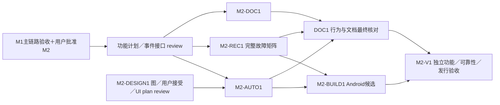

# M2：Android 自动模式、可靠性与发行准备

状态：后续 Android 阶段提案，未获实现批准。依赖 M1 Android 主链路验收和用户明确批准 M2；**没有 iOS／macOS／Xcode／iOS 签名或 iOS 回归前提。** 本阶段承接 M1 延后的完整故障注入、自动模式和 Android 发行准备；M1 第二网络路径仍可作为补充，不因未测阻塞 M2。

## 任务与实际产物

增加用户自愿开启的设备接入自动模式、适用前台服务与可停止通知；处理启动拒绝／通知限制／超时／系统终止和完整任务恢复。完成 M1 延后的断网、校验不一致、写完／提交边界 kill、重复插拔、重复执行和自有临时清理故障矩阵。提供 Android 双语说明、Apache-2.0 及依赖通知、干净源码构建／实际安装、发行候选来源清单。正式发布仍需用户决定具体渠道／签名，不默认获得授权。

所有新增 UI（设置、启动提示、通知和异常状态）由 M2-DESIGN1 使用 `build-web-apps:frontend-app-builder` 先生成完整图并获用户接受，之后才提取 tokens／组件／详细 UI 实施计划；M1 接受图不自动覆盖新服务 UI。M2-UI 是独立结果，不替代自动模式或故障矩阵证据。

| ID／owner | 依赖 | 文件范围 | 工作／产物 |
| --- | --- | --- | --- |
| M2-DESIGN1／Design | M2 功能 brief，用户确认相应设计范围 | `docs/design/` M2 概念／接受／后续 spec | 完整新增 UI 与必要状态概念，接受后详细视觉计划及独立 UI review。 |
| M2-AUTO1／Android service | M1 用户 gate；UI 子任务另等 DESIGN1 接受／plan review | `.../service/`、`attachment/`、设置／通知适配；Manifest 由构建 owner 集成 | 合法启动入口、适用服务类型、默认关闭、可停止通知、拒绝／超时降级；真实 APK 与入口矩阵。 |
| M2-REC1／Android reliability | M1；AUTO1 事件接口先冻结 | `.../execution/`、`lifecycle/`、测试；data 由原 owner 修改 | 单一执行权、完整故障注入矩阵、停止／kill 对账、人工暂停、节点停止／重建；不误完成、不覆盖、不丢完整副本。 |
| M2-DOC1／Documentation | M1 结果、M2 功能契约；最终等 AUTO1／REC1 行为 | `README.md`、`README.zh-CN.md`、`docs/build-android.md`、`compatibility.md`、Android 依赖通知 | Android 首次配置／授权／网络／空间／恢复／模式与限制，真实设备矩阵和复现步骤。 |
| M2-BUILD1／Delivery | AUTO1／REC1 集成；正式签名／渠道仅相关发行项需用户决定 | Android workflow、版本配置、`scripts/release/android/`、devcontainer 定义 | 在固定 devcontainer 内构建／单测／静态检查真实安装候选，记录镜像 digest／manifest 或 Dockerfile、可重建依赖缓存卷、源码 SHA／工具链／版本／ABI／产物 SHA-256／CI 清单；安全签名与已批准渠道方案。缺容器运行时只阻塞构建节点，不回退宿主。 |
| M2-V1 #31／独立 verification＋review | AUTO1／REC1、DOC1／BUILD1 最终版本 | `docs/validation/m2/`、验收脚本 | Pixel／Pocket 模式与恢复、完整故障矩阵、M2-UI 对照；独立按文档构建安装候选，许可／秘密核验；最终报告与 M3 计划。 |

M0-B3 #11 自动模式职责映射 AUTO1／REC1；其完整故障子范围在本阶段执行。V1 不含 iOS 回归，iOS 加入后的 Android 回归在 M3-V1。新增 DOC1／BUILD1 承接 Android 首发准备；旧 M3 IDs 仍留 M3 处理 iOS 加入后的最终文档和产物。M2 采用统一 execution plan 的一次独立 plan review，最终由非作者进行 integrated/device/release review。

## 环境与可判定验收

Pixel 6 Pro／Pocket 3／USB-C、可操作设置与通知权限、fnOS／授权测试 SMB、固定 devcontainer 构建。Android 默认 `minSdk 29`（Android 10），不处理 Android 9 及更低版本；允许较新的 `compileSdk`／`targetSdk`，但实际 API 号在实现开始前由容器内稳定工具链确定并记录。记录 Android／API、服务类型和入口，以及源码 SHA／工具链／ABI／产物 SHA-256。Dora 新 Android physical lease 只补充一般服务行为，不证明指定 USB／供电／性能。正式签名／渠道未定只阻塞正式发行项，不阻止安全 debug 候选；缺 iOS 环境不影响本阶段。所有结果使用 `PASS`／`FAIL`／`BLOCKED`／`NOT_RUN`，低概率或条件不满足项不得改写为通过。

### 容器内与外部验收边界

M2 的 Android／Go／bridge 构建、单测、静态检查、故障矩阵所需测试包、APK／AAR
生成和哈希清单均在固定 devcontainer 内执行；宿主只启动容器和保存脱敏产物，
需要 ADB 时只做显式连接。设备接入／前台服务、Pixel／Pocket／fnOS、通知权限、
USB／SMB、远端读回、重启／锁屏／拔线及租约清理属于容器外部动作。M2-AV01–04、
AV06 的设备与系统触发、AV05 故障矩阵、AV08 文档抽验和 AV09 许可／秘密核验，
均须将构建工具链证据与外部动作结果分开记录；Dora 使用容器构建出的 APK。

缺容器运行时、固定镜像／manifest 或 Dockerfile、可重建依赖卷时，构建与依赖它
的验收为 `BLOCKED`，不得回退到宿主 JDK／SDK／NDK／Go／Gradle 缓存。该边界不
增加 Android 9 及以下兼容矩阵或新的发布门槛。

| ID | 动作／环境 | PASS 结果 | 证据／失败或阻塞 |
| --- | --- | --- | --- |
| M2-AV01 | 全新安装、默认配置接入 Pocket，离开 App | 自动模式默认关闭，不持续后台传输；返回仍按 M1 前台语义恢复 | 设置／通知／任务日志；默认后台执行 `FAIL` |
| M2-AV02 | 显式开启自动模式并通过经过验证的合法入口接入 | 正确服务类型、可见可停止通知、单任务执行；USB attach／connectedDevice 不冒充豁免 | 实体入口／系统日志；合法路径不成立 `BLOCKED`／重新 review |
| M2-AV03 | 导入／上传中分别关开关、停止通知 | 停服务与新操作，状态保存、完整副本保留；人工暂停不因打开 App 解除 | 状态／文件／日志；继续后台或丢状态 `FAIL` |
| M2-AV04 | 注入启动拒绝、通知限制、适用超时／系统终止 | 不崩溃或冒完成，等待原因明确，返回对账可恢复 | 真实系统触发与模拟回调分列；不适用记 `NOT_RUN` |
| M2-AV05 | M1 延后的完整故障矩阵：断网／切网、校验不一致、写完或提交边界 kill、锁屏／返回／重启／重复插拔／重复执行 | 不误完成、不覆盖、不重复完成；人工暂停保持；完整副本和自有临时清理可对账 | Pixel＋Pocket／fnOS 故障矩阵；数据完整性错误 `FAIL`，未触发场景 `NOT_RUN` |
| M2-AV06（M2-UI） | 用 `view_image` 对照接受图与设置／通知／错误 native 截图，实际点击操作 | 接受范围内文案／层级／字体／颜色／间距等≥5项符合，copy diff 与 ledger 齐全，通知操作真实生效 | UI 独立结果；无接受图不开始 UI 实施，视觉不代功能 |
| M2-AV07 | 独立 agent 在固定 devcontainer 按文档 checkout/build，执行单测／静态检查，安装容器候选并调用 Go | 不依赖未记录宿主文件或缓存，APK／版本／ABI／源码 SHA／工具链／产物 SHA-256 与清单对应 | 容器定义／命令／CI／APK/hash／安装；缺运行时 `BLOCKED`，不声称字节级可复现 |
| M2-AV08 | 按双语说明初始化、授权失效重选、空间不足恢复及 M1 第一网络主链路抽验 | 文档步骤可复现，远端摘要一致，Android 默认／可选模式与说明一致 | 独立记录／真实设备矩阵；第二网络未测可记 `NOT_RUN` |
| M2-AV09 | 核对下载文件／版本／CI／源码，审依赖许可和产物／日志／导出 | Apache-2.0 及适用通知齐全，无凭据／Tailnet 状态／私钥进入公开内容 | manifest／hash／许可／秘密核验，不回显秘密；泄露立即停止 |

超时等难复现条件用平台支持机制时记录方法，不把单测当真实系统触发。性能只报告实际测量，无未约定阈值。完整故障矩阵必须与 M1 的基本 `on_open` 恢复分开报告；M1 未运行项不得被回填为 M1 通过。

## 完成、停止与用户 gate

产物包括真实 Android 候选、hash／源码 SHA／CI、双语构建／使用说明、许可／设备与模式矩阵、M2-AV01–09、完整故障报告、独立 review、M2-UI 对照及 M3 计划。无合法启动能力、完整故障导致误完成／覆盖／丢副本、必需真机缺失时暂停依赖节点，不能改 FGS 类型绕限制。

用户 review 当前候选、证据和限制，决定具体 Android 发布动作及是否批准 M3；签名／渠道未确认则发行项 `BLOCKED`，不假称正式发布。M3 未获批准前不做 iOS 实现。
