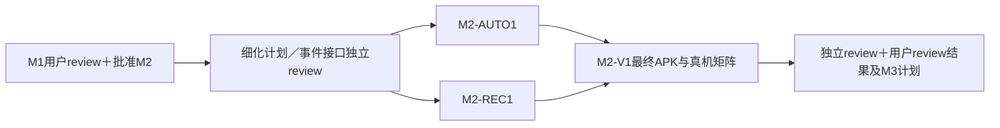

# M2：Android 可选自动模式与恢复强化

状态：后续阶段计划，未获实现批准。依赖 M1 双平台前台基础版验收和用户明确批准 M2；所有任务仍先写细化计划、独立 review 后实现，再独立 review／验收。

## 任务、范围与产物

M1 已具备前台导入、SMB／tsnet 和基本恢复。本阶段增加 Android 自愿开启的设备接入自动模式及合规前台服务，强化系统终止／超时下恢复；保持 iOS 前台范围，不承诺 iOS USB 后台唤醒。

| ID／owner | 依赖 | 文件范围 | 要做的事与产物 |
| --- | --- | --- | --- |
| M2-AUTO1／Android service | M1 用户gate | `android/app/src/main/.../service/`、`attachment/`、相关Manifest／资源由构建owner集成 | 接入判定、设置开关、适用服务类型、合法启动入口、可停止通知、拒绝／超时降级；真APK和入口／系统条件矩阵 |
| M2-REC1／Android recovery | M1；先冻结AUTO1事件接口 | `execution/`、`lifecycle/`及其测试，data改动由原data owner实施 | 服务／UI单一任务所有权、关闭／停止／kill对账、人工暂停不解除、节点停止与重建；故障注入测试和持久状态证据 |
| M2-V1／独立device verification＋Review | AUTO1／REC1最终集成产物 | `docs/validation/m2/`、必要验收脚本 | Pixel＋Pocket真机、测试SMB／飞牛故障矩阵、iOS前台回归；最终review报告、APK／哈希及M3计划修订 |

原 M0-B3／issue #11 拆出的自动模式职责迁至 AUTO1／REC1，#11保留历史拆分记录；前台职责已在 M1-V1 验收，不能把其结果当作自动模式成功。AUTO1 与 REC1 可在冻结事件接口后分目录并行，V1 必须等待同一最终SHA。

## 环境和通过标准

使用 Pixel 6 Pro、Pocket 3、USB-C 数据线、可操作系统设置和通知权限、真实飞牛／授权测试SMB。记录实际Android/API、target SDK、服务类型、启动入口及相机固件。Dora物理设备仅补充不同系统一般服务行为；不能替代USB接入、指定机型、供电或性能证据。

| ID | 动作／环境 | PASS结果 | 证据／未通过条件 |
| --- | --- | --- | --- |
| M2-V01 | 全新安装默认配置，接入Pocket并离开App | 自动模式默认关闭，不持续后台传输；返回App仍按M1前台恢复 | 设置／通知／任务日志；默认后台执行失败 |
| M2-V02 | 用户开启自动模式，通过已验证合法入口接入并开始导入／上传 | 适用服务类型和可见可停止通知，任务只启动一次；USB attach或connectedDevice声明不被当成豁免 | 真机入口步骤／系统日志／任务ID；合法入口无法成立则阻塞范围，不绕过限制 |
| M2-V03 | 活跃导入／上传分别关闭自动模式或点击停止 | 停止服务和新操作，保存明确等待或人工停止状态；本地完整副本保留，重新打开不解除人工暂停 | 停止前后日志／数据库／文件摘要；丢状态或继续后台运行失败 |
| M2-V04 | 注入启动拒绝、通知权限限制、服务超时和系统终止 | 不崩溃、不冒报完成；进入等待打开App／可理解错误，打开后对账恢复 | 系统条件／注入命令／状态；人工模拟回调与真实系统触发分列，关键适用场景未运行则未完成 |
| M2-V05 | 上传中断网／切网，校验或提交边界kill后重启 | 人工暂停不解除；系统等待可恢复；无重复完成、无覆盖、只清自有临时文件 | 故障矩阵／远端摘要／任务记录；任何数据完整性违例FAIL |
| M2-V06 | Pixel锁屏／返回／重启、重复插拔；iOS前台基础流程回归 | Android按选择模式行为一致，无双重执行；iOS仍仅前台且原验收关键路径不退化 | 同一commit产物／Android真机／iOS回归报告；不以构建通过替代 |

不承诺无限后台执行或固定性能指标。系统超时等难复现场景使用平台支持的测试机制时写清方法，不能把代码单测当成真实系统触发。不能完成规定的适用场景则报告未运行；如需缩小支持系统／入口范围，重新独立review并交用户决定。

## 产物、停止与用户 gate

产物为最终APK／SHA-256／源码SHA／CI、开关与通知操作说明、入口／系统兼容矩阵、M2-V01–06逐项报告、独立review与修复。无合法后台入口、真机不可用、服务类型不适用或恢复破坏完整性时暂停依赖节点，不能伪装网络上传为设备连接工作绕过限制。

全部适用必需项通过且独立review后，用户review当前产物及M3计划并明确批准下一阶段。未批准不开始发行工作。
