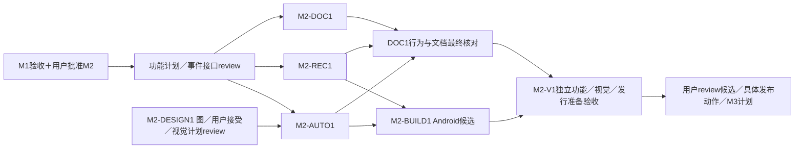

# M2：Android 自动模式、可靠性与发行准备

状态：后续Android阶段提案，未获实现批准。依赖M1 Android验收和用户明确批准M2；**没有iOS／macOS／Xcode／iOS签名或iOS回归前提**。原M3的Android首发准备迁入本阶段，具体范围随当前计划供用户review。

## 任务与实际产物

增加用户自愿开启的设备接入自动模式、适用前台服务与可停止通知；处理拒绝／超时／系统终止和任务恢复。并提供Android双语说明、Apache-2.0及适用依赖通知、干净源码构建／实际安装、发行候选来源清单。是否正式发布仍需用户决定具体渠道／候选，不默认获授权。

所有新增UI（设置、启动提示、通知和异常状态）由M2-DESIGN1使用 `build-web-apps:frontend-app-builder`先生成图并获用户接受，之后才提取tokens／具体组件／详细UI实施计划。M1接受图仅覆盖其已有范围；不自动接受新服务UI。下面只约定功能要求，不预定布局。

| ID／owner | 依赖 | 文件范围 | 工作／产物 |
| --- | --- | --- | --- |
| M2-DESIGN1／Design | M2功能brief，用户确认进入相应设计范围 | `docs/design/` M2概念／接受／后续spec | 完整新增UI与所需状态概念，接受后详细视觉计划及独立review |
| M2-AUTO1／Android service | M1用户gate；UI部分另等DESIGN1接受／计划review | `.../service/`、`attachment/`、设置／通知适配；Manifest由构建owner集成 | 合法启动入口、适用服务类型、默认关闭开关、可停止通知、拒绝／超时降级；真实APK与入口矩阵 |
| M2-REC1／Android recovery | M1；AUTO1事件接口先冻结 | `.../execution/`、`lifecycle/`、测试；data由原owner修改 | 服务／前台协调单一执行权、停止／kill对账、人工暂停、节点停止／重建；故障测试 |
| M2-DOC1／Documentation | M1结果、M2功能契约；最终等AUTO1／REC1行为 | `README.md`、`README.zh-CN.md`、`docs/build-android.md`、`compatibility.md`、Android依赖通知／说明 | Android首次配置／授权／网络／空间／恢复／模式与限制，真实设备矩阵和复现步骤 |
| M2-BUILD1／Delivery | AUTO1／REC1集成；正式签名与渠道仅相关发行项需用户决定 | Android构建workflow、版本配置、`scripts/release/android/` | 干净Linux构建、真实安装候选、SHA／版本／ABI／hash／CI清单；安全签名与已批准渠道分发方案 |
| M2-V1 #31／独立verification＋Review | AUTO1／REC1、DOC1／BUILD1最终版本 | `docs/validation/m2/`、验收脚本 | Pixel／Pocket模式与恢复，接受图对照；独立按文档构建安装候选，许可／秘密核验；最终报告与M3计划 |

M0-B3 #11自动模式职责映射AUTO1／REC1；V1不再含iOS回归，iOS加入后的Android回归在M3-V1。新增DOC1／BUILD1承接旧M3任务的Android首发部分；旧M3 IDs仍留M3处理iOS加入后的最终文档和产物。

## 环境与可判定验收

Pixel 6 Pro／Pocket 3／USB-C、可操作设置与通知权限、飞牛／授权测试SMB、干净Linux构建。记录Android/API、target SDK、服务类型和入口。Dora新Android物理lease只补充一般服务行为，不证明指定USB／供电／性能。Android正式签名／渠道未定只阻塞正式发行项，不阻止制作安全debug验证产物；缺iOS环境不影响本阶段。

| ID | 动作／环境 | PASS结果 | 证据／失败或阻塞 |
| --- | --- | --- | --- |
| M2-AV01 | 全新安装、默认配置接入Pocket，离开App | 自动模式默认关闭，不持续后台传输；返回仍按前台语义恢复 | 设置／通知／任务日志；默认后台执行FAIL |
| M2-AV02 | 显式开启自动模式并通过经过验证的合法入口接入 | 正确服务类型、可见可停止通知、单任务执行；USB attach或connectedDevice不冒充豁免 | 实体入口／系统日志；合法路径不成立则阻塞／重新review范围 |
| M2-AV03 | 导入／上传中分别关开关、停止通知 | 停服务与新操作，状态保存、副本保留；人工暂停不因打开App解除 | 状态／文件／日志；继续后台或丢状态FAIL |
| M2-AV04 | 注入启动拒绝、通知限制、适用超时／系统终止 | 不崩溃或冒完成，等待原因明确，返回对账可恢复 | 真实系统触发与模拟回调分列；必需适用场景未运行则未完成 |
| M2-AV05 | 断网／切网、校验／提交边界kill，锁屏／返回／重启／重复插拔 | 无双重执行、覆盖或重复完成；人工暂停保持，自有临时清理正确 | Pixel＋Pocket／飞牛故障矩阵；数据完整性错误FAIL |
| M2-AV06 | 用view_image对照接受图与设置／通知／错误native截图，实际点击操作 | 文案／层级／字体／颜色／间距等≥5项符合，copy diff与ledger齐全，通知操作真实生效 | 无接受图不开始UI实施；视觉和功能分别通过 |
| M2-AV07 | 独立agent在干净Linux按文档checkout/build，安装候选并调用Go | 不依赖未记录本机文件，APK／版本／ABI／源码SHA与清单对应 | 命令／CI／APK/hash／安装；不声称字节级可复现 |
| M2-AV08 | 按双语说明初始化、授权失效重选、空间不足恢复及真实链路抽验 | 文档步骤可复现，远端摘要一致，Android默认／可选模式与说明一致 | 独立记录／真实设备矩阵，只列通过版本 |
| M2-AV09 | 核对下载文件／版本／CI／源码，审依赖许可和产物／日志／导出 | Apache-2.0及适用通知齐全，无凭据／Tailnet状态／私钥进入公开内容 | manifest／hash／许可／秘密核验，不回显秘密；泄露立即停止 |

超时等难复现条件用平台支持机制时记录方法，不把单测当真实系统触发。性能只报告实际测量，无未约定阈值。未测必须列明；如缩小入口／系统范围，重新review并由用户决定。

## 完成、停止与用户 gate

产物包括真实Android候选、hash／源码SHA／CI、双语构建／使用说明、许可／设备与模式矩阵、M2-AV01–09、独立review、接受图／native对照及M3计划。无合法启动能力、关键恢复破坏完整性、必需真机缺失，暂停依赖节点，不能改FGS类型绕限制。

用户review当前候选、证据、限制，决定具体Android发布动作及是否批准M3；发布记录真实结果，不编造链接。尚未确认正式签名／渠道则该发行项阻塞，不假称正式发布；可以提交已经完成的准备包供用户作最后决定。M3未获批准前不做iOS实现。
