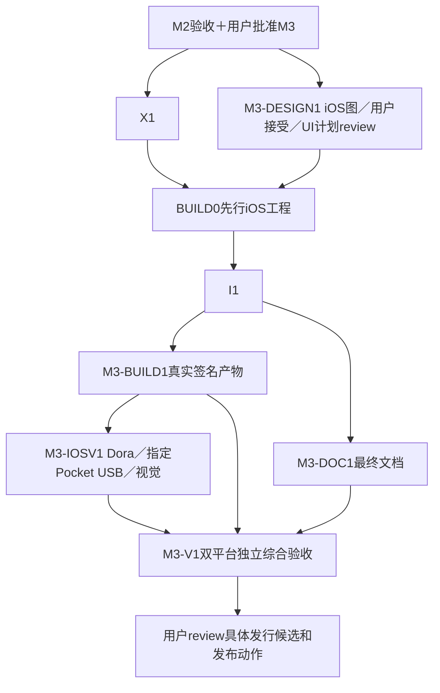

# M3：iOS 可用前台版与双平台交付

状态：后续阶段提案，未获实现批准。M2 Android结果经用户review并明确批准M3后，才开始iOS桥接、原生App与实际设备验证。M0–M2只保留正常Go边界和规则向量，不为本阶段提前开发抽象／平台代码。

## 要做的事与实际产物

交付Swift／SwiftUI iOS App：目录授权／bookmark、完整受管理副本、原生SQLite与Keychain保护状态、规则配置／预览、App前台LAN或内嵌tsnet到SMB、读回SHA-256与无覆盖提交、人工暂停和系统等待恢复。只验证iPhone 17 Pro／USB-C，不含Lightning或USB后台唤醒；离开／挂起停止新工作，返回重新建连。

交付macOS／Xcode构建及有效签名／安装路径的真实iOS产物、Dora iOS物理设备一般流程和Pocket→iPhone→飞牛两路径证据。同步验证Android既有能力未回归，补齐双平台文档、来源清单与发行候选。无签名archive／simulator产物不能代替iOS物理安装。

此时再评估iOS需要的最小Go桥接和状态保护接口调整，必须对Android回归负责，不追溯增加已完成M0–M2的iOS前置。iOS bundle ID建议沿用 `io.github.ghostflying.ferry`，实际profile／设备注册／安装／分发条件在M3验证，密钥只经受保护secret引用。

## 先图后视觉方案

M3-DESIGN1由design agent用 `build-web-apps:frontend-app-builder`／Image Gen生成iOS完整主界面和必要来源／目标／规则／任务、首次授权／bookmark失效、暂停／恢复／空间／校验错误等状态。已有Android图可作风格参考，但不自动接受iOSsurface。用户接受后才提取tokens、组件和详细UI实施计划；本文件仅列功能和验证，不预设视觉布局。

X1纯核心实验可在M3获批后独立推进；任何可见实验壳／App界面须遵守概念接受关口。若X1只用无UI测试harness，不把测试输出称为视觉验证。设计接受与M3实施批准分别记录。

## 工作包与单owner

迁入M0-X1 #12、M1-BUILD0 #24、M1-I1 #26，保留稳定历史ID／issue但当前milestone为M3。新M3-IOSV1承接原M1-V1的iOS／真实USB部分；M3-DOC1／BUILD1／V1保留，但原Android首发职责已移M2-DOC1／BUILD1。

| ID／owner | 依赖 | 文件范围 | 工作／产物 |
| --- | --- | --- | --- |
| M3-DESIGN1／Design | M3功能brief与设计授权 | `docs/design/` iOS概念／接受／后续spec | skill完整screen/states，用户接受后详细视觉spec与实施计划review |
| X1（M0-X1 #12）／Core iOS bridge | M2用户gate、可用macOS/Xcode；可见UI另等DESIGN1 | `experiments/mobile-core/ios/`、`core/mobile/iosbridge/`、`docs/validation/m3/bridge.md` | 在当前生产核心上验证单Go runtime桥接、64位计数、操作ID、取消／迟到事件、文件所有权；此时才设计必要iOS保护存储回调；输出实际构建／调用证据 |
| BUILD0（M1-BUILD0 #24）／Delivery bootstrap | X1、DESIGN1接受及视觉计划review | `ios/` project／workspace、`ios/Ferry/App.swift`最小入口、初始脚本／CI | 可构建并调用核心的iOS壳及签名安装路径；完成后入口owner移交I1，构建配置移交M3-BUILD1，记录SHA，无双向依赖 |
| I1（M1-I1 #26）／iOS native | X1、BUILD0、接受图／UI计划review | `ios/Ferry/App.swift`、`Source/`、`Spool/`、`Data/`、`Security/`、`UI/`、`Lifecycle/`、`Execution/`及测试 | SwiftUI真实功能、security-scoped访问／协调读取、完整副本／哈希／空间、SQLite事务与不可变revision、Keychain／加密StateStore、前台协调、生产核心与错误状态 |
| M3-DOC1／Documentation | M2结果与M3契约；最终等I1行为 | 双语README、`docs/build-ios.md`、`compatibility.md`、依赖通知／说明 | 补iOS签名安装／授权／空间／前台恢复、USB-C限制、真实矩阵；保留Android准确说明 |
| M3-BUILD1／Delivery final | BUILD0、I1集成；最终发行方式由用户决定 | iOS workflow／project构建配置、`scripts/release/ios/`、版本清单；Android回归构建由同owner协调 | 干净macOS实际产物、安全签名安装、SHA／版本／hash／CI对应；Android回归产物；不是I1的前置构建包 |
| M3-IOSV1／device verification | I1、BUILD1实际iOS包、授权环境 | `docs/validation/m3/ios-devices.md`、`pocket-iphone-fnos.md`、恢复／视觉验收脚本 | Dora新iOS physical lease普通流程；Pocket／iPhone17 Pro USB-C／飞牛LAN＋App tsnet大文件／恢复；native图对照、cleanup；不能以云机代USB |
| M3-V1／独立Review＋verification | X1、BUILD0、I1、DOC1／BUILD1、IOSV1 | `docs/validation/m3/report.md`、review／发行清单 | 最终双平台版本独立复现／Android回归、共享向量、许可／秘密／产物核验；交用户具体发布包和下一范围 |

X1与DESIGN1可并行；BUILD0是独立先行issue，I1不依赖最终BUILD1。I1按source/spool/data/ui目录拥有代码，构建文件仅Delivery写入，修改核心需给原Core owner具体范围并review，避免并行覆盖。

## 环境、数据与恢复要求

本阶段才需要实际macOS／Xcode、合法签名／profile／设备注册或其他批准安装路径、Dora iOS物理lease、iPhone17 Pro／Pocket／USB-C／飞牛／Tailnet和足够空间。Dora按用户AGENTS显式iOS＋physical查询，从新idle／online占用，双重核session，每次操作前核对，finally清理并释放；旧会话即使同用户也不接管。

真实相机USB不由云设备代替。Keychain／加密StateStore确认访问策略、原子持久化、退出／重登和备份排除；仅私有目录不宣称加密。bookmark失效要求重新授权，App离开保存停止，返回恢复系统等待／重建socket，人工暂停保持。完整副本、空间预算、读回／no-replace、提交后kill对账沿用已验证语义，但要在iOS实际重验，不能只引用AndroidPASS。

## 可判定验收

| ID | 环境／可重复动作 | PASS结果 | 证据／失败或阻塞 |
| --- | --- | --- | --- |
| M3-IV01 | 干净macOS按文档构建、实际签名安装物理iPhone并调用Go | 单Go runtime、版本／包hash／CI对应；取消／重开／迟到事件隔离有效 | Xcode／依赖／安装／bridge日志；无签名archive不算，缺条件BLOCKED |
| M3-IV02 | Android与iOS实际调用同套规则向量／配置错误输入 | 输出一致，非法配置拒绝；iOS哈希未知预览不伪造目标 | 两平台bridge结果／向量，不以纯Go测试代实际调用 |
| M3-IV03 | iOS配置／人工暂停后kill，修改目标revision再重启 | 状态持久，旧任务引用旧目标，暂停不解除；意图／完成事务正确 | SQLite与重启测试 |
| M3-IV04 | iOS普通来源和真实Pocket分别完整读取；拔线／取消／权限失效 | 原文件不变，partial不可上传；bookmark失效可重选；大文件导入流式校验 | 普通／USB证据分列，Dora不代USB |
| M3-IV05 | 未知size／容量不足／保留副本／超上限 | 明确等待空间，不清未完成副本；空间恢复后可继续 | 可控预算／状态测试，不填满用户存储 |
| M3-IV06 | Pocket→iPhone17 Pro USB-C→飞牛LAN和App tsnet各传>4GiB真实素材 | 本地／远端完整SHA-256一致，完成落盘且源不变 | 系统／固件／线材／字节／摘要；缺指定实体组合未通过 |
| M3-IV07 | 飞牛预存目标、并发提交、重复连接；断网／校验失败／提交后记录前kill | 不覆盖／重复完成，校验失败保留副本，重启对账或文件级重试，只清自有临时 | iOS实际故障矩阵／文件摘要／状态，不引用Android代验收 |
| M3-IV08 | iOS离开／锁屏／挂起／返回、人工暂停后重启 | 不新增后台传输承诺，保存停止；返回重新访问来源／建连并恢复系统等待，人工暂停保持 | Dora普通＋指定iPhone实测，未触发场景明确NOT_RUN |
| M3-IV09 | 登录重启／退出重登，检查Keychain保护、状态文件、备份与导出 | 身份按契约复用，受保护状态原子持久，秘密不进入导出／日志，模式不静默回退 | 脱敏身份／安全适配测试；泄露停止 |
| M3-IV10 | 对接受的iOS概念与native截图用view_image并操作流程 | 文案／层级／字体／颜色／间距等≥5项对照，copydiff与ledger，控件实际工作 | Android图不自动接受iOS；未接受不开始视觉细节／实施 |
| M3-IV11 | 用同一最终版本重跑Android前台关键链路及M2模式抽验 | Android能力不退化，核心改动无状态／路径／数据完整性回归 | Pixel/Pocket/飞牛结果与Android包hash，构建不代回归 |
| M3-IV12 | 独立按双语文档重建／安装两端，核产物／源码／依赖通知／秘密及lease cleanup | 步骤可复现，真实兼容矩阵／hash／版本一致，无秘密；有效本会话lease安全释放 | manifest／许可／安装／cleanup；条件缺失或必需项未测则整体未通过 |

构建可复现指过程／来源，不承诺包字节级相同。性能仅报告真实环境测量。缺签名、macOS、网络、有效lease或指定USB时继续独立节点但规定验收未完成；如接受受限范围须用户重新决定，当前无此豁免。

## review 与用户 gate

每复杂包先落计划／独立review，UI须额外接受图后再细化视觉实施；实现后独立代码／功能／视觉验收。最终提交真实可安装iOS产物与Android回归包、hash／CI／SHA、全部IV行、接受图对照、兼容／限制、许可与发行步骤。用户review并批准具体发布动作后执行；发布结果记录真实链接，准备产物不冒称商店已发布。

OpenDAL／网盘等保持未排期backlog，选服务后另立任务、可判定验收和用户gate，不能自动开始。
