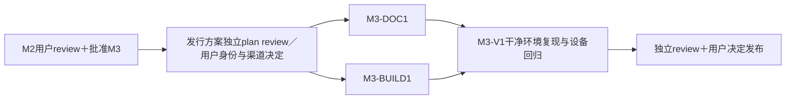

# M3：双平台 OSS 发行准备与可复现交付

状态：后续阶段计划，未获实现批准。依赖 M2 验收及用户明确批准；本阶段不首次引入APK或iOS可运行App，M0／M1已经要求实际产物。

## 工作包与产物

| ID／owner | 依赖 | 文件范围 | 要做的事／可审查产物 |
| --- | --- | --- | --- |
| M3-DOC1／Documentation | M2用户gate | `README.md`、`README.zh-CN.md`、`docs/build-*`、`docs/compatibility.md`、依赖通知／发行说明 | 双语首次配置、目录授权、网络模式、缓存／读回成本、恢复／限制；Apache-2.0和适用依赖通知；真实设备矩阵与未测范围 |
| M3-BUILD1／Delivery | 用户确认应用ID／bundleID／签名／分发 | 构建workflow、`scripts/release/`、版本配置 | 固定验证过依赖；干净Linux／macOS源码构建；受保护签名、版本／commit对应和批准渠道的实际安装产物；公开验证信息不含私钥 |
| M3-V1／独立verification＋Review | DOC1／BUILD1最终版本 | `docs/validation/m3/`、发行清单 | 不参考作者额外指引按文档重建／安装；双平台核心流程和Android模式回归；产物／源码／通知／凭据核验，提交用户发行审阅包 |

DOC1与BUILD1在版本／渠道契约后可分目录并行，V1只验收同一版本。主代理协调；作者不能给自己的发行包签署独立通过。

## 环境与可判定验收

需要干净Linux Android构建环境、macOS／Xcode iOS环境、受保护签名／profile、合法安装或分发渠道、指定手机与Pocket／飞牛复核条件。用户尚未选择正式分发渠道或签名时先提供完整可review方案和已获授权的验证产物，正式发行项保持阻塞；不自行宣称商店发布成功。

| ID | 动作与环境 | PASS结果 | 证据／失败或阻塞 |
| --- | --- | --- | --- |
| M3-V01 | 独立agent在干净Linux按文档checkout指定SHA并构建Android | 不靠未记录本机文件可构建真实APK；安装启动并调用Go；输出版本／ABI与说明一致 | 命令／工具链／CI／APK哈希／安装记录；缺步骤或占位产物FAIL |
| M3-V02 | 独立agent在干净macOS按文档构建并按批准签名路径安装iOS | 真实物理设备可启动／调用共享核心；签名要求和设备适用性明确 | Xcode／依赖版本、包／哈希／安装证据；无签名archive不算，条件缺失BLOCKED |
| M3-V03 | 从发行候选两平台配置来源／目标并做导入→上传→读回、重复连接；Android默认／可选模式抽验 | 远端SHA-256一致，不覆盖、不重复完成，运行模式正确；兼容矩阵只列实际通过组合 | 指定设备／系统／相机／NAS及结果；构建成功不替代功能 |
| M3-V04 | 按双语说明进行首次授权、权限失效重选、空间不足和恢复 | 步骤可执行，错误／空间／前后台限制与App实际行为一致 | 独立操作记录与修订diff；关键说明不能复现FAIL |
| M3-V05 | 核对源码SHA、版本号、包信息、CI与实际下载文件；审查依赖与许可 | 同一发行清单对应正确产物；Apache-2.0与所需NOTICE／第三方通知存在且适用 | manifest／哈希／依赖许可清单；不能用模板勾选代替实际核查 |
| M3-V06 | 检查源码、包、日志、截图、配置导出和签名流程 | 无测试账号／Tailnet状态／私钥等秘密；公开产物及报告边界明确 | 可重复扫描与人工核验记录（不回显秘密）；发现泄露立即停止并报告 |

可复现指过程和来源可复现，不宣称APK／IPA字节级相同。性能只报告真实设备测量，不建立未经用户约定的阈值。未测机型不可列支持；历史结果标明版本，重大变更后重跑受影响场景。

## 完成与用户 gate

交付双语说明、完整构建命令、最终源码SHA／版本、真实可安装产物／哈希／下载或批准安装入口、兼容矩阵、逐项验收和独立review。必需环境／签名／渠道缺失则相关项阻塞；准备产物不等于已公开正式发布。

用户review发行候选、验证边界和具体发布动作，明确批准后才按批准渠道发布。发布结果再记录实际链接／版本，不编造成功。M3之后OpenDAL／网盘、多目标等仍是未排期backlog；选定服务和能力后先形成独立milestone任务／验收并获用户批准，不能自动启动。
