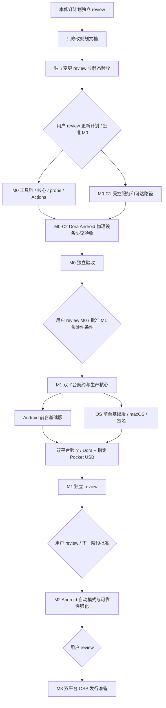

# 里程碑范围修订计划：Dora 协议验证与 M1 双平台基础版

状态：本轮文档修订的执行计划；独立 plan review 和最终变更 review 状态见[审查记录](../reviews/milestone-scope-revision-review.md)。本文件仅覆盖已授权范围内的文档修订；用户的新范围决定不等于批准 M0 应用、Actions 实现或设备占用。独立审查通过后才修改下列详细文档，完成后再进行独立变更 review。

## 用户决定与本次设计解释

2026-10-02 用户明确要求：“iOS 移入 m1，smb 连接可以先通过 dora 的云真机验证，m0 结束再考虑真机走完整链路”。保留之前的 Apache-2.0、agents 执行、每项 plan／review／impl／review 与 milestone 用户关口。

直接决定：iOS 不再留到 M6；M0 可以先用 Dora 云端物理设备验证 SMB；Pocket 3／Pixel／飞牛完整链路不再是 M0 完成的前提，相关真机工作在 M0 之后才进入执行计划。这里的“真机完整链路”指用户持有相机和手机的实际 USB／OTG 链路；Dora 云端物理设备仍属于真实手机，但不代表接到了 Pocket 3。

本计划提出的合理解释（需在更新后计划中明确供用户 review）：M0 保留真实 probe APK／Actions、SMB 完整传输和数据完整性实验，将 Dora Android **物理设备**作为连接／协议运行门槛；M1 扩为 Android 与 iOS 的可用前台基础版，实质包含规则、原生来源与持久状态、完整副本、SMB／内嵌 tsnet 及恢复，而不是只加一个 iOS 构建 spike。Android 可选自动模式作为后续强化，双平台默认 on_open 不变。

M1 的指定 Pocket／Pixel 和 Pocket／iPhone USB-C 验收由 M0 结果后的用户 gate 确认执行条件。缺硬件可推进独立实现／Dora 测试，但完整相机兼容性未测不能声称通过；如果用户希望在未测 USB 条件下接受受限版本，必须明确 review 该范围变更。当前修订不代表这种豁免。

## 文件所有权与修改范围

由规划 agent 单 owner 修改：

| 文件 | 修改目的 |
| --- | --- |
| `README.md` | 将 iOS 排期改为 M1 双平台基础版，M0 Dora 证据范围与无可运行 App 状态一致 |
| `docs/product-plan.md` | 双平台 M1 前台范围，Android 自动模式后续；不改变完成定义、只读来源、冲突与缓存约束 |
| `docs/architecture.md` | 保留单一 Go runtime 和原生边界，更新双平台实现／验证时序；iOS 状态保护、构建签名与生命周期为 M1 依赖 |
| `docs/platform-evidence.md` | 区分官方能力、M0 受控服务／Dora 协议、M1 Pocket USB／飞牛证据；所有测试仍未运行 |
| `docs/implementation-plan.md` | 重写 milestone DAG、范围和历史迁移索引；保留用户 gate |
| `docs/plans/m0.md` | 删除 Pixel／Pocket／真实飞牛作为 M0 gate，新增受控网络和 Dora Android 物理设备任务／租约约束；保留 APK 与完整性门槛 |
| `docs/plans/m1.md` | 扩成双平台可用前台基础版，迁入原 M2／M3／M6 核心实现及真实 USB 验收；macOS／Xcode 和 iOS 物理设备为明确依赖 |
| `docs/plans/m2.md`、`docs/plans/m3.md` | 为保留的后续里程碑分别写具体工作包、产物、环境、可判定验收、证据、阻塞与用户 gate，不只有阶段标题 |
| `examples/pocket3-fnos.json` | 仅在时序修订需要语义改动时调整；默认配置语义不变则不改 |

governance agent 负责 AGENTS、协作流程、bootstrap、GitHub milestones／issues／PR；review agent 独立维护审查报告。规划 agent不编辑其文件，不修改已提交的历史审查结论；新增修订记录覆盖当前版本，历史 PASS 保留其 SHA 范围。

## 任务 ID 与阶段迁移

不删除或复用旧 ID 表示新含义，原 issue 保留历史并注明迁移／替代；新增 ID 使用全限定阶段前缀。详细文档列出旧 ID、当前归属、替代节点和未执行状态。

| 原阶段／任务 | 新归属与处理 |
| --- | --- |
| M0 A1–A6 | 保留 M0：工具链、桥接、SMB、tsnet、Android probe、Actions；A4 明确受控网络依赖，A5 普通 provider 验证不含 Pocket |
| 新 M0-C1 | 受控 SMB 服务／host可达性、授权拓扑、凭据及测试数据隔离；云设备实际可达性由 C2 在自己的新租约上先验证，再进行完整协议验收 |
| 新 M0-C2 | 独立 Dora Android 物理设备租约、APK 安装／运行、完整 SMB／tsnet 实验与证据、清理 |
| M0 B1／B2 | 保留历史 ID，迁入 M1：真实 Pocket／Pixel 只读来源与完整飞牛链路，M0 后经用户 gate 才执行 |
| M0 B3 | 前台生命周期验证迁入 M1；可选 USB attach／FGS 分支迁入 M2。旧 issue 记录拆分映射，不把 M1 前台通过当成自动模式通过 |
| M0 X1 | 迁入 M1，iOS 单一 Go 产物／macOS 构建与运行成为实质前置，不能以无环境风险接受代替 M1 iOS 通过 |
| M0 R0 | 保留 M0，验收依据改为 A1–A6／C1／C2，报告不含未做的 Pocket 兼容性结论 |
| M1 P1–P6 | 保留并扩展双平台契约、构建、规则、原生持久状态、UI 和真实产物；不复用旧 Android-only 验收通过结论 |
| M1 P7 | 保留为 M1 独立综合 review，必须等双平台前台能力和规定验收完成 |
| 新 M1-BUILD0／D1／I1／T1／V1 | 分别为独立先行 iOS 工程／构建配置、Android 来源／spool、iOS 原生来源／spool／状态／UI、共享生产传输与状态保护、双平台故障恢复／真机验收；细化文件所有权避免与 P4／P5 重叠 |
| 旧 M2 来源缓存／M3 SMB／M6 iOS | 核心实现迁入 M1，旧 milestones／issues 标明 superseded-by／moved-to，不关闭成已完成 |
| 旧 M4 Android 运行模式 | on_open 迁入 M1；可选自动模式与扩展可靠性为修订后的 M2 |
| 旧 M5 OSS | 修订后 M3：双平台发行准备与 OSS 验收；不延迟 M0／M1 可安装产物 |
| OpenDAL／网盘 | 继续排在双平台基础版和相应用户 gate 之后 |

governance 可保留旧 GitHub milestone 的历史名称／关闭为 superseded，并新建当前阶段，或迁移原 issue 到新 milestone；必须显式记录旧→新映射，不能默默改 ID 造成历史 review 指向错误范围。

现有 issue 关系保留：M0-B1／B2／B3 对应 #9／#10／#11；M0-X1 为 #12；M0-R0 为 #13；M1-P1–P7 为 #14–#20。#9／#10／#12 迁 M1；#11 作为原分拆入口说明其前台子范围迁 M1-V1、自动模式子范围迁 M2-AUTO1，不关闭为完成。新增 M0-C1、M0-C2、M1-BUILD0、M1-D1、M1-I1、M1-T1、M1-V1；新增独立 iOS 主包为 M1-I1，先行工程包 M1-BUILD0 完成后明确移交应用入口与构建文件 owner；现有 X1 承接 iOS 核心构建桥接，P4／P5 仅承担 Android，I1 承担对应 iOS，P6／V1 为双平台交付／验收，不重复新建同职责任务。M2 计划使用 M2-AUTO1／REC1／V1，M3 使用 M3-DOC1／BUILD1／V1。governance 维护迁移审计和 revision checkpoint，不覆盖旧 review 的文件快照。

## 每个保留 milestone 的必备内容

依据用户追加要求，每阶段文件必须提供“做什么→产物→在何处怎样验证→什么算通过→证据→何时阻塞→用户 gate”的对照表。M0–M3 为当前保留的 milestone；OpenDAL 等仅列未排期 backlog，不伪装成已有可执行 milestone，其被选中时须先补计划及可判定验收。

| 阶段 | 任务与产物 | 环境／可判定验收 | 证据与阻塞／gate |
| --- | --- | --- | --- |
| M0 | 工具链、单一核心、SMB 完整性 probe、真实 APK／Actions、受控服务、Dora Android 物理设备实验 | 实际物理设备安装调用；受控 SMB 上传／读回摘要一致；大文件和竞争／中断通过；连接与全传分别判定 | APK／哈希／commit／CI、设备与服务配置、实验报告；缺服务可达路径／有效租约／关键能力则相关项阻塞；独立验收后用户批准 M1 |
| M1 | 双平台可用前台 App、规则／原生状态／完整副本、生产 SMB／tsnet；Android APK 和可安装签名 iOS 包／安装路径；Pocket 两平台验收 | Linux／macOS 构建、Dora 双平台普通网络／生命周期、Pixel／iPhone 17 Pro USB-C + Pocket + 飞牛；字节／摘要、冲突、恢复、暂停和规则一致性逐项通过 | 双平台产物与安装证据、USB／网络分路径矩阵、恢复测试；缺 macOS／签名／硬件不把整阶段标通过；M0 后用户先确认本阶段条件，完成后批准 M2 |
| M2 | Android 可选接入自动模式、通知停止、服务限制处理及故障恢复强化 | Pixel 真机 + Pocket 接入，适用 SDK／服务启动条件；默认关闭、关闭即停止、手动暂停不自解除、拒绝／超时／终止恢复且不重复完成或覆盖 | APK／版本、系统／入口／类型、设备录像／日志和故障矩阵；不能触发的场景明确未运行，关键启动能力不成立则重新 review 范围；用户批准 M3 |
| M3 | 双平台发行准备、源码构建／安装说明、Apache-2.0 及依赖通知、版本与产物对应、真实兼容矩阵 | 干净 Linux／macOS runner 按文档构建；Android／iOS 安装与核心流程回归；发行签名／分发方式由用户决定，不假设具备 | 可下载实际产物／哈希／完整 SHA、复现记录、依赖／兼容清单；签名／渠道未决则发行项阻塞，不伪称已发布；用户 review 发布范围及后续 backlog 是否另立 milestone |

详细文档需把本表展开为具体 pass 条件，不以“支持／稳定／完善”代替结果。M3 的构建可复现指步骤可复现；不自动声称字节级确定性。

## M0 受控网络与设备验收原则

受控 SMB 不是默认已存在，也不假设 Dora 与开发机／家庭 NAS 同局域网。M0-C1 先记录服务 owner、服务器版本、测试共享、短期最小权限账号、允许流量范围及清理步骤。

优先选择授权的测试服务加入隔离测试 Tailnet，由 App 内 tsnet 访问。直接 SMB 路径仅在平台提供经批准的私有网络／隧道且云设备真实可达时验证；不得为了验收把 TCP 445 无限制暴露公网。基础 TCP／SMB Dial 可由实验网络在 host 上验证，Dora 上若只验证 tsnet 路径，报告必须明确，不能标记 Dora“局域网通过”。host 可达路径由 C1 证实；Dora 路径由 C2 在自己的新租约上实际验证，缺环境只阻塞依赖节点。

M0 要求 Dora Android 物理设备实际执行 probe → 完整本地构造素材 → SMB 上传／flush／读回 SHA-256／无覆盖提交，至少覆盖非稀疏大于 4 GiB、取消／断线、身份重建与竞争。合成文件的生成、原始摘要和字节数可复现；不宣称代表相机 USB。连接成功与完整传输分别报告。

设备由新查询的 explicit Android + physical、idle + online 候选建立本会话新租约；双重读取记录 session ID，每次 ADB／续租／释放前核对，finally 清理及释放后验证。租约结束前撤销测试节点／账号并清理设备上的素材／状态；不得复用他人或旧会话租约。M1 的 Dora iOS 也适用同样隔离规则，安装还取决于实际可用签名／设备注册方式，不能假设裸 IPA 可装。

## 修订后的 DAG 和验收

本次仅验收文档：链接与 JSON 合法；所有当前阶段说法一致；旧 ID 有迁移表；无残留“M0 必须 Pocket E2E”“iOS 到 M6”或“M1 仅 Android 壳”的当前承诺；历史迁移说明允许引用旧范围。DAG 无环且用户 gate 保留；M0 不能把云端 SMB 当 OTG；M1 的 iOS 实质交付、构建／签名／硬件依赖清楚。提供具体文件 diff 与 SHA 给独立 reviewer。

## 停止条件与本轮边界

本 mini plan 有 P0／P1 时先修订，不修改详细范围。遇到阶段解释与用户原话冲突、需要减弱内容校验／无覆盖等安全承诺、或 iOS 只剩标签迁移时，停止并提交 root／reviewer。详细规划修订完成经独立 review 后交用户；不因内部 PASS 开始 M0。

本轮文档编写与独立 review 阶段不运行构建、不启动 SMB 服务、不占用 Dora、不连接设备、不处理真实凭据，也不自行提交／推送。独立 review 后的原子文档提交、推送与 GitHub 同步由协调 agent 按用户已有授权安排，不属于应用实现批准。真实设备和网络条件只记录依赖，不能预填通过。
